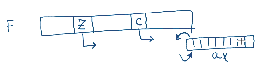

# Assembler

## Общее
1. У процессора есть набор регистров, в которые можно помещать данные.


## Команды
1. **`mov dst, src`** - перемещает данные из `src` в `dst`.
    * можно перемещать данные из регистра в регистр (R <--> R)
    * можно перемещать данные из памяти в регистр (M <--> R)
    * _нельзя_ перемещать данные из памяти в память (M <--> M)
    * Примеры
        * `mov ax, 3` - помещаем в регистр `ax` значение 3
        * `mov ax, bx` - помещаем в регистр `ax` значение хранящееся в `bx`
        * `mov ax, bx + 3` - помещаем в регистр `ax` значение хранящееся в `bx` + 3
        * `mov ax, [bx]` - помещаем в регистр `ax` значение на которое указывает регистр `bx`
1. **`sub ax, bx`** // ax = ax - bx
1. **`add ax, bx`** // ax = ax + bx
1. **`inc ax`** // ax = ax + 1
1. **`dec ax`** // ax = ax - 1

## Передача управления
1. Для передачи управления служат метки

    ```asm
    add ax, 3
    label1:
        inc bx
    label2:
        inc ax
    ```
1. Метка - это адрес следующей за меткой команды
1. **`jump label`** - переходит на метку
1. **`call label`** - переходит на метку и сохраняет на стеке адрес возврата. Важно чтобы в конце инструкции под `call` была инструкция `ret`

    ```asm
    my_fun:
        inc bx
        ret
    ```
1. **`int N`** - переходит к обработчику прерывания с номером N. Выход осуществляется с помощью инструкции `iRet`

## Условные переходы
1. В составе регистра процесора существует регистр флага. Он хранит биты результатов операции

    

    * `c` - выстанавливается в 1 когда в результате операции произошло переполнение или заимствование из старшего разряда
    * `z` - выстанавливается в 1 когда в результате операции получились все 0

1. **`cmp ax, bx`** - вычитает из ax bx. После этой команды регистр флагов иницилизирован и его можно использовать с помощью вариаций команды `jmp`.
1. **`jle`** - срабатывает если `ax <= bx`, т.е. подняты флаги `c` или `z`
1. **`jz`** - переходим если в результате операции получились 0 (поднят флаг `z`)
1. **`jne`** - срабатывает если `!z`

```asm
mov $5, ecx
mov $5, edx
cmp ecx, edx
je equal
; if it did not jump to the label equal,
; then this means ecx and edx are not equal.
equal:
; if it jumped here, then this means ecx and edx are equal
```
