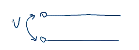
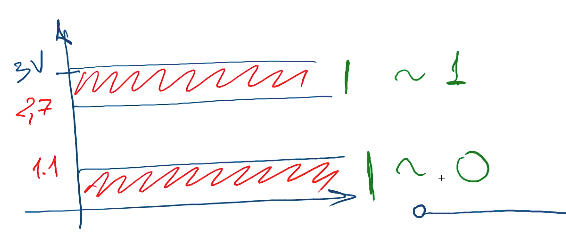
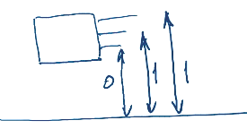

# Бинарные числа и операции

## Логические 0 и 1
1. Мы можем измерить напряжение между двумя проводниками.

    

1. К примеру у нас есть линия постоянного тогда с напряжением 3V (вольта). Тогда можно выделить область возле 3V и возле 0V и обозначить их соответственно 1 и 0.

    

1. У микросхемы существуют выходы (ножки). И если мы будем измерять напряжения между несколькими ножакми, то сможешь считать текущее состояние микросхемы

    

## Представление чисел
1. Числа представляются в бинарном формате: 10011100010101.
1. Если разбить бинарную запись числа по 3 бита, то можно легко перевести в 8 систему.
1. Если разбить бинарную запись числа по 4 бита, то можно легко перевести в 16 систему.

## Представление отрицательных чисел
1. Прямой код: самый левый бит резирвируется для знака. Таким образом если в самом левом бите 1, то число отрицательное, а если 0 - положительное. Имеет следующие недостатки:
    * не эффективно складывать
    * не эффективно проверять на 0 (т.к. 0 и -0 имеют разные представления)
1. Обратный код: самый левый бит до сих пор резирвируется под знак. В случае когда число отрицательное - остальные биты инвертируются.
    * является промежуточным этапом для построения дополнительного кода
1. Дополнительный код: берём обратный код и добавляем к нему одну единицу. Преймущества:
    * 0 и -0 имеют одинаковые представления
    * эффективное и элегантное сложение засчет переполнения.

## Представление чисел с плавающей точкой
1. Числа с плавающей точкой представлаяются в экспоненциальном виде: `m * 2^e`. Где **m** - мантисса, **e** - степерь 2 (экспонента)
1. 32-bit число с плавающей точкой содержит:
    * 1 бит под знак
    * 8 бит под экспоненту
        * 1 бит под знак экспоненты
        * 7 бит под значение экспоненты
    * 23 бита под мантиссу

    
