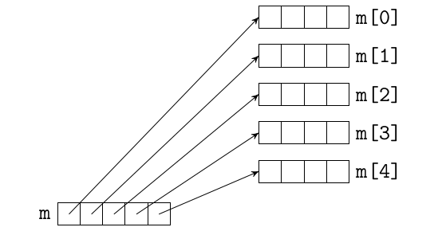

# Многомерные массивы

## Многомерные встроенные массивы
1. С++ позволяет определять многомерные массивы
    ```cpp
    int m2d[2][3] = { {1, 2, 3}, {4, 5, 6} };
    for (size_t i = 0; i != 2; ++i ) {
        for (size_t j = 0; j !=3; ++j) {
            cout << m2d[i][j] << ' ';
        }
        cout << endl;
    }
    ```
1. Элементы m2d располагаются в памяти по строчкам

## Динамические массивы
1. Для выделения одномерных динамических массивов обычно используют оператор `new []`.
    ```cpp
    int * m1d = new int [100];
    ```
1. Какой тип долен быть у указателя на двумерный массив ?
    * Пусть `m` - указатель на двумерный массив типа `int`.
    * Значит `m[i][j]` имеет тип `int` (точнее `int &`).
    * `m[i][j]` <=> `*(m[i] + j)`, т.е. тип `m[i]` - `int *`
    * аналогично `m[i]` <=> `* (m + i)`, т.е. тип `m` - `int **`.
1. Чему соответствует значение `m[i]` ?
    * Это адрес строки с номером `i`.
1. Чему соотвествует значение `m`
    * Это адрес массива с указателями на строки.

## Двумерные массивы
1. Неэффективная схема
    

    ```cpp
    int ** create_array2d(size_t a, size_t b) {
        int ** m = new int * [a];
        for (size_t i = 0; i != a; ++i) {
            m[i] = new int [b];
        }

        return m;
    }

    void free_array2d (int ** m, size_t a) {
        for (size_t i = 0; i != a; ++i) {
            delete [] m[i];
        }

        delete [];
    }
    ```

1. Эффективная схема

    

    ```cpp
    int ** create_array2d (size_t a, size_t b) {
        int ** m = new int * [a];
        m[0] = new int[a * b];

        for (size_t i = 1; i != a; ++i) {
            m[i] = m[i - 1] + b;
        }

        return m;
    }

    void free_array2d (int ** m) {
        delete [] m[0];
        delete [] m;
    }
    ```

