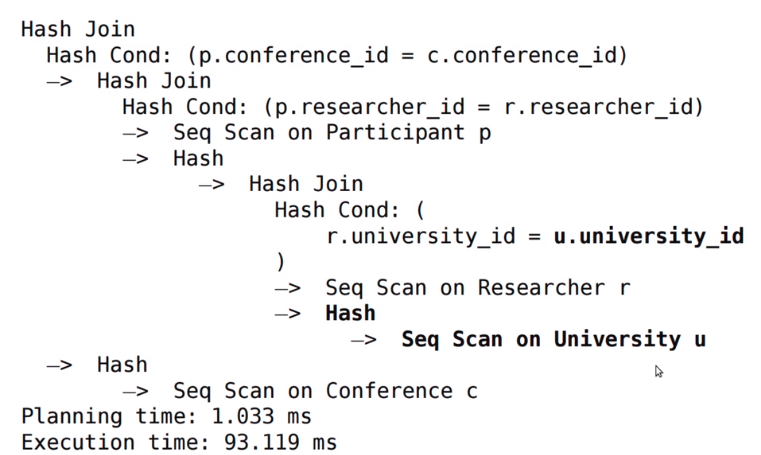

# Postgres

## Table Of Content
- [Commands](#commands)
- [Multiversion Concurency Control][#multiversion-concurency-control]
- [Analize Query](#analize-query)

## Commands
1. List databases
    ```
    \list
    \l
    ```
1. Connect to database
    ```
    \connect database_name
    ```
1. List all tables
    ```
    \dt
    ```
1. Describe table
    ```
    \d table
    ```
1. Show indexes
    ```
    \di
    ```

## Multiversion Concurency Control
1. Problem to solve: we need to have atomicity, consistency and isolation in concurent environment.
1. The easiest way to implement it is:
    * Shared read lock + not shared write lock
    * Dissadvantages: if one user want to write: the whole world would stop.
1. There are two ways to implement MVCC:
    * Store revert log (Oracle, MsSQL)
    * Store all versions of the row (PostgreSQL). We will call one version as a tuple.
1. PostgreSQL stores creation transaction ID (`xmin`) and expiration transaction id (`xmax`) for every tuple.
1. PostgreSQL stores statuses for all transactions (CLOG).
1. Having CLOG, xmin and xmax we could decide if tuple is visible for transaction or not.
1. Visible tuples:
    * must have a creaation transaction id that:
        * is a commited transaction _and_
        * is less than the transaction counter stored at query start _and_
        * was not in-process at query start
    * must have an expire transaction id that:
        * is blanck _or_
        * is aborted _or_
        * is greater than the transaction counter stored at query start _or_
        * was in process at query start

## Analize Query

```sql
EXPLAIN ANALYZE
    SELECT Conference.name, University.name
    FROM Conference
        JOIN Participant ON (Conference.conference_id = Participant.conference_id)
        JOIN Researcher ON (Participant.researcher_id = Researcher.researcher_id)
        JOIN University ON (Researcher.university_id = University.university_id);
```

1. Get pg stats

    ```sql
    SELECT attname, n_distinct
    FROM pg_stats
    WHERE tablename='my-table-name';
    ```

1. Update pg stats
    ```sql
    analize;
    ```



* `Seq Scan`- последовательное сканирование
* `Hash` - составление хэш таблицы (`key: values[])
* `Hash Join` - join двух хэшированных таблиц
