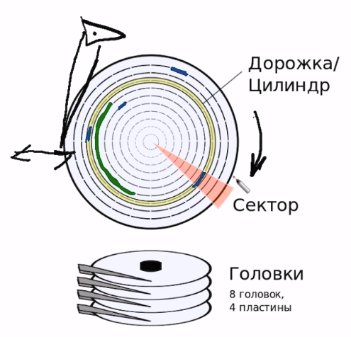

# Запросы

## Table of content
- [Жизненный цикл запроса](#жизненный-цикл-запроса)
- [HDD](#hdd)
- [Оконные функции](#оконные-функции)
- [Обобщенные Табличные выражения](#обобщенные-табличные-выражения)
- [Рекурсивные запрсоы](#рекурсивные-запрос)

## Жизненный цикл запроса
1. Приложение устанавливает соединение с БД
1. Приложение посылает текст запроса серверу БД
1. Сервер проверяет синтаксическую корректность запроса
1. Сервер проверяет существуют ли запрошенные таблицы\колонки + проверяет имеет ли текущий пользователь доступ к этим данным
1. Сервер составляет план запроса
1. Сервер выполняет запрос
1. Сервер отсылает данные приложению.

## HDD

* 

1. На крутящейся поверхности винчестера находятся концентрические окружности - **дорожки**.
1. Каждая дорожка разделена на некоторое количество дуг - **секторов**.
1. К поверхности диска преставлено коромысло, к которому преставлены считывающие магнитные головки.
1. Для того чтобы прочитать данные с диска головке нужно переместится на необходимую дорожку и дождаться когда до неё докрутится необходимый сектор.
1. Сектор является единицей чтения информации, чтобы прочитать с сектора 1 байт нужно прочитать весь сектор целиком.
1. Размер сектора варьируется в диапазоне от `[512b - few kb]`
1. База данных хранит данные на нескольких секторах подряд. Такой набор секторов называется страницей.
    * Для `mysql` по умолчанию размер страницы `16kb` (можно настроить 64, 32, 8)
    * `postgresql` размер страницы - `8kb`

## Обобщенные Табличные выражения
1. По сути это представления которые живут в рамках одного запроса.
    ```sql
    WITH
    SubmittedPapers AS (
        SELECT ocnference_id, COUNT(*) AS paper_count,
        FROM PaperConference
        GROUP BY Conference_id
    ),
    KwPerPaper AS (
        SELECT P.id as paper_id,
            SUM(CASE
                WHEN PK.keyword_id IS NULL THEN 0
                ELSE 1 END) as kw_count
        FROM Paper P
            LEFT OUTHER JOIN PaperKeyword PK ON P.id = PK.paper_id
        GROUP BY P.id
    )

    SELECT *
    FROM KwPerPaper KP
        JOIN PaperConference PC ON KP.paper_id = PC.paper_id
        JOIN SubmittedPapers SP ON SP.conference_id = PC.conference_id
    WHERE SP.paper_count > 100 AND KW.kw_count < 2;
    ```

## Оконные функции
1. Разбивает выборку на партиции (аналогично группировке строк)
1. Сортирует каждую партицию по какому-то признаку
1. `SELECT` кроме использования текущей строки может так же оперировать с окном, состоящим из строк той же партиции
1. Если партиция не упорядочнена, то значение агрегата считается по всем строкам попавшим в одно окно с текущей строкой. Если партиция упорядочнена, то значение агрегата считается от начала окна до текущей строки включительно.

    * отношение числа статей на конференции к среднему числу статей на данной конференции по всем годам

        ```sql
        SELECT year, name,
            paper_count / AVG (paper_count) OVER (
                PARTITION BY name
            )
        FROM SubmittedPapersPerEvent;
        ```

    * Рост суммы количества статей на конференции по годам

        ```sql
        SELECT year, name,
            paper_count / AVG (paper_count) OVER (
                PARTITION BY name ORDER BY year ASC
            )
        FROM SubmittedPapersPerEvent;
        ```

1. Можно самостоятельно указать размер окна

    * Отношение количества статей на текущей конференции к количеству статей на прошлой.

        ```sql
        SELECT year, name,
            paper_count::FLOAT / FIRST_VALUE(paper_count) OVER (
                PARTITION BY name ORDER BY year ASC
                ROWS BETWEEN 1 PRECEDING AND CURRENT ROW
            ) as yoy_growth
        FROM SubmittedPapersPerEvent;
        ```

## Рекурсивные запросы
1. Позволяют при формировании запроса получать доступ к предыдущему результату.
1. Расчёт ряда фибоначи:
    ```sql
    WITH RECURSIVE Fibonacci AS (
    SELECT 1 AS ord, 1 as value, 1 as next_value

    UNION ALL

    SELECT ord + 1 as value, next_value, value + next_value
    FROM Fibonacci
    WHERE ord < 10
    )

    SELECT * from Fibonacci;
    ```

1. Обход дерева в ширину:
    ```sql
    CREATE TABLE Vertex (
        id INT PRIMARY KEY,
        value TEXT,
        parent_id INT REFERENCES Vertex
    );

    WITH RECURSIVE Bfs AS (
        SELECT V.id as vertex_id, V.parent_id as parent_id, V.value, 0 as level
        FROM Vertex V
        WHERE id = 42

        UNION ALL

        SELECT V.id as vertex_id, V.parent_id as parent_id, V.value, Bfs.level + 1 AS level
        FROM Vertex V JOIN Bfs ON V.parent_id = Bfs.vertex_id
    )

    SELECT * FROM Bfs;
    ```
