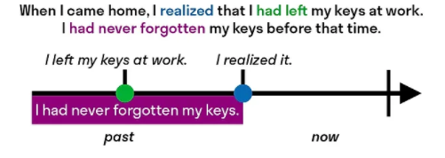

# Tenses

## Present

### Present Perfect
1. Something happened, occured or was finished in the past and there is some result or consequence that affects us, impacts us right now in the current moment.
    * I've cleaned the kitchen and now it looks great
    * (in US past simple is mostly used instead)
1. just, already and yet (yet only in questions and negative sentenses)
    * **just** - action happened a very short time ago
        * Is your friend here? No, he's just left.
    * **already** - something was done before it was planned / expected.
        * Do you want to see this movie tonight? Oh, I've already seen that.
    * **yet** (only in negative sentense and questions)
        * Have you seen that movie? No, I haven't seen it yet.
    * (in US past simple is used more)
1. have ever - asking about things that people have done / not done in their life until the present time
    * Have you ever been in Paris? No, I have never been there
    * Have you ever been in a car crash?
1. how long have - to show that something happened in past and continues to present moment
    * for
        * How long how you been married? We have been married for 10 years.
    * since
        * I've waited since April for my package to arrive.
    * **don't use present perfect with ago**
        * I met him 10 years ago.

### Present Perfect Continious

## Past

### Past Simple
1. Completed action in the past.

### Past Perfect
Action has finished before another action in the past

Examples:
    * When we arrived at the cinema, the film had already started.
    * I hadn’t seen a live elephant before our trip to Africa.
    * By the time she arrived at the station, the train had already left.
    * I hadn't packed my bags when the taxi arrived.
    * Had you read the book before you saw the film?
    * She'd never been to London, so she was looking forward to the trip.
    * We went to India last year. It was the first time I'd ever traveled by plane.

### Past Continuous
1. An action cotinued in the past in the time of speaking.
    * When I arrived from work, he was watching TV.
    * I tried to call her, but she was busy washing her hair.
1. Questoins
    * Was he running late?
    * Was she visiting you?
    * What were you doing at 2pm?
1. Often used with past simple.

### Past Perfect Continious
1. An action started in the past and continued happening until another moment in the past.
1. Usually used together with past simple.

