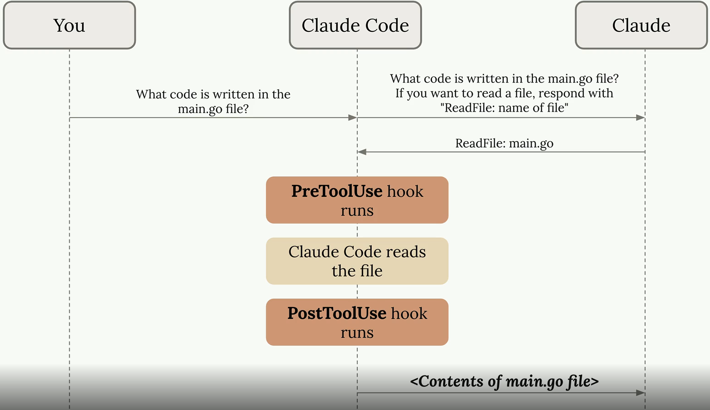

# Claude

## Thinking Mode

Used to go **deep** into problem.

### Thinking Mode Types

The following modes are supported, to activate just type this word

* `<think>` - basic extended thinking
* `<think hard>` - more thinking budget
* `<think harder>` - even more thinking budget
* `<ultrathink>`- maximum thinking budget

Claude supports different thinking modes that control how reasoning is performed and displayed:

## Planning Mode

Used to get wider understanding of problem and come up with solution.

### Activation

`shift+tab` in claude code

words like **step-by-step** in clade.ai or chatgpt.com

## Working with Context

* `<esc> + <esc>` - rewind the conversation (and code) to an earlier point in time, allows to maintain only valuable context
* `/compact` - summarizes the conversation and continue, helps Claude stay focused but remember what it has learned in the curren tsession
* `/clear` - clears the context. Useful when you want to start working on a new task in the same session

## Hooks

Hooks are shell commands that execute in response to events like tool calls. They allow you to intercept and modify Claude Code's behavior.

### Use cases

* Run a code formater after Claude edits a file
* Stop Claude from editing or reading a particular file
* Run tests automatically after a file is changed
* Block deprecated funtion usage

### Hook Flow

### Key Points

check for all available hooks with `/hooks` command in code

* **PreToolUse** hook runs before Claude Code executes a tool (like reading a file)
* **PostToolUse** hook runs after the tool completes
* Hooks can be configured in settings to customize Claude Code's behavior
* Useful for logging, validation, or modifying tool behavior
