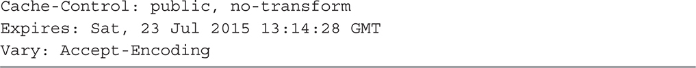
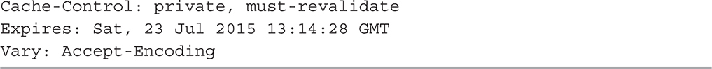
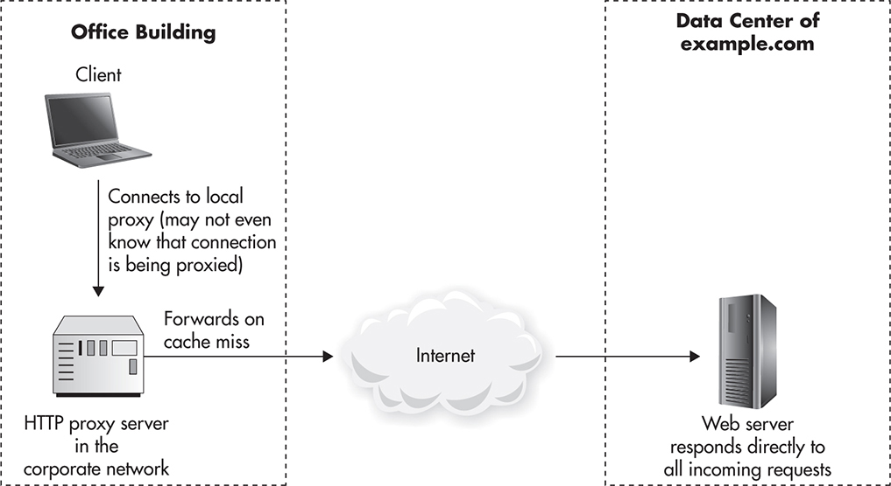
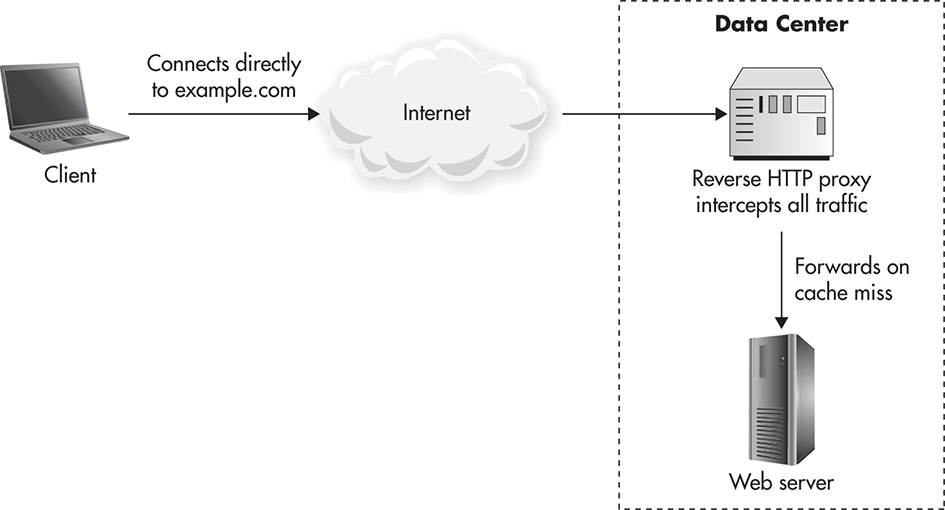
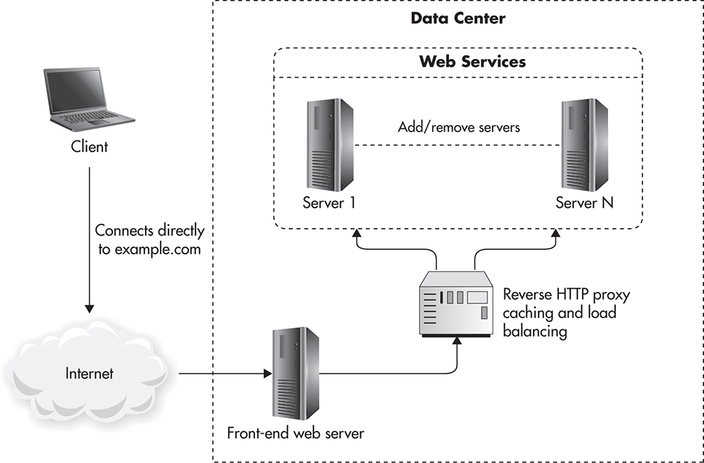
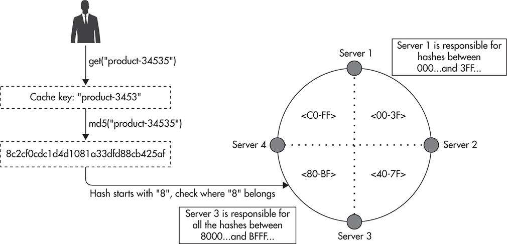
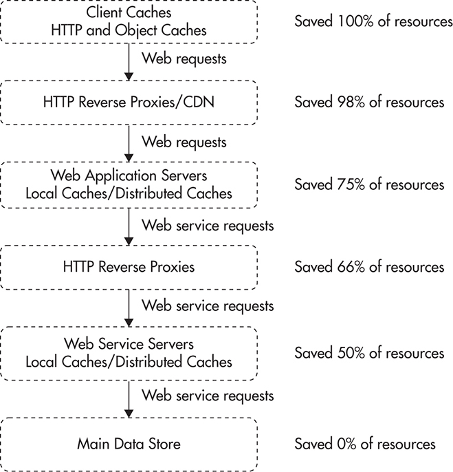

# Caching

  * [Hit Ratio](#hit-ratio)
  * [HTTP Cache](#http-cache)
  * [Cache Types](#cache-types)
  * [Scaling Object Cache](#scaling-object-cache)
  * [Caching Tips](#caching-tips)

## Hit Ratio
1. **Cache Hit Ratio**

    ```
    cacheHitCount / (cacheHitCount + cacheMissCount)
    ```

1. **Relative performance**

    ```
    relativePerformance = 1 / (cacheHitCost * cacheHitRatio + cacheMissCost * (1 - cacheHitRatio))
    ```

1. Factors which affect cache hit ratio
    1. Key Space - how many possible keys do we have
    1. Key TTL
    1. Cache Size - how many object can we store

## HTTP Cache
1. [MDN HTTP Caching](https://developer.mozilla.org/en-US/docs/Web/HTTP/Caching)
1. Static files headers

    

1. Non cachable objects HTTP headers

    

1. Private files cache headers

    

1. Best Practices
    * do not use Cache-Control: max-age and Expires together, because it creates confusing behaviour
    * Do not use html caching metadags (like http-equiv="cache-control"). Again it dublicates cache logic and creates confusing behaviour

## Cache Types
1. Browsers Cache
1. Caching Proxy - setup up by enterprice companies or ISP.
    * this type of proxies loses popularity because of wide spreading of HTTPS (now proxies can not decrypt headers to examine traffic)

    

1. Reverse Proxy
    * public

        

    * private

        

1. CDN

    

## Scaling Object Cache
1. Data partitioning for object cache is quite simple. There are a lot of libraries which allow to accept multiple cache servers.
1. As a usefull way to partition keys between shard we could implement the following:
    * Assign to every key number from range (for example first two chars from md5hash)
    * Every shard is responsible for the part of data which is lockated in shards range:

        

    * When the new shard is added - adjust key range a little bit

        

## Caching Tips
1. Decrease **Key Space**
1. Increase **TTL**
1. Decrease **Object size**
1. Cache High Up the Call Stack

    

1. Reuse cache among users - for example we build an app for restraunt recomendataion based on user location.

    ```
    # Bad URL
    GET /restaurants/search?lat=-11.11111&lon=22.2222

    # Good URL
    GET /restaurants/search?lat=-11.11&lon=22.22
    ```

    * we lost a little bit of accuracy, but we gathered a lot in case of caching

1. To decide what to cache evaluate **Aggregated Time Spent**

    ```
    aggregated time spent = time spent per request * number of requests
    ```

