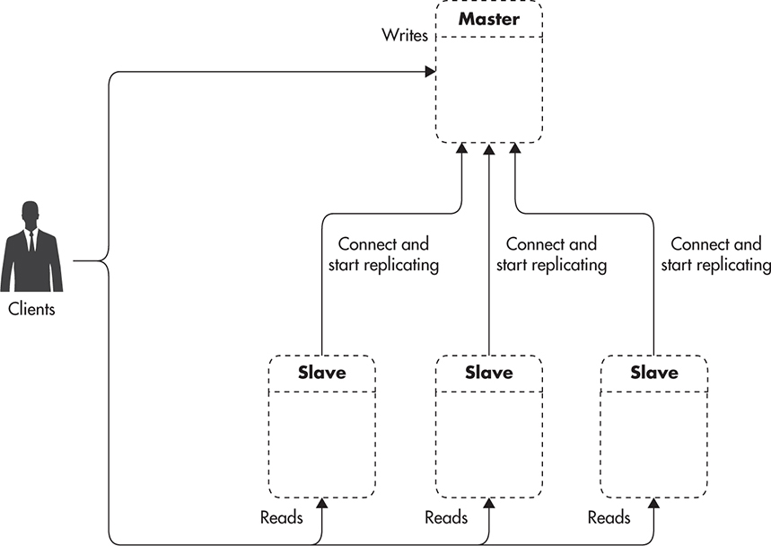
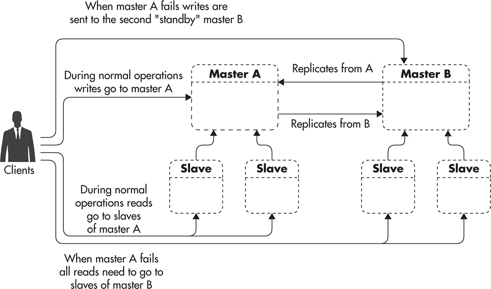
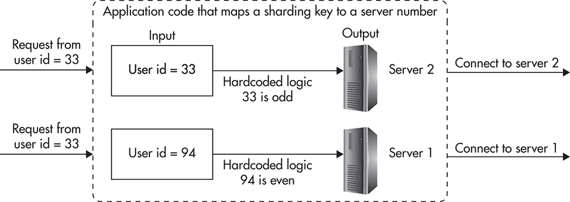
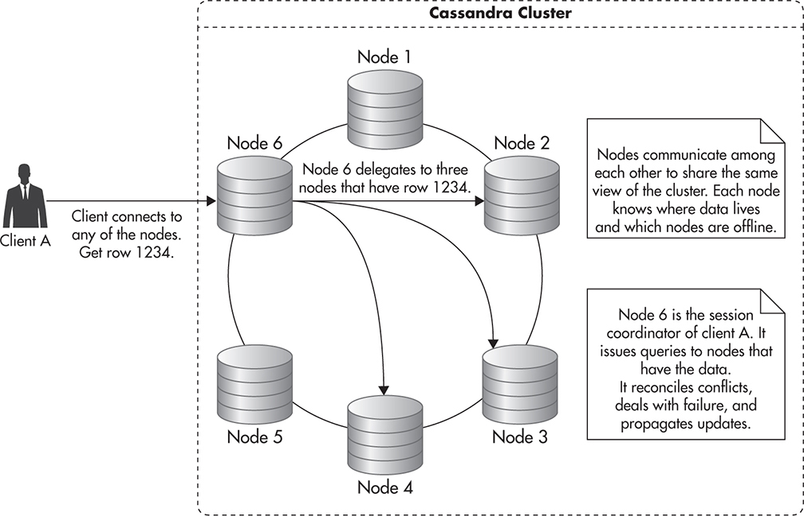
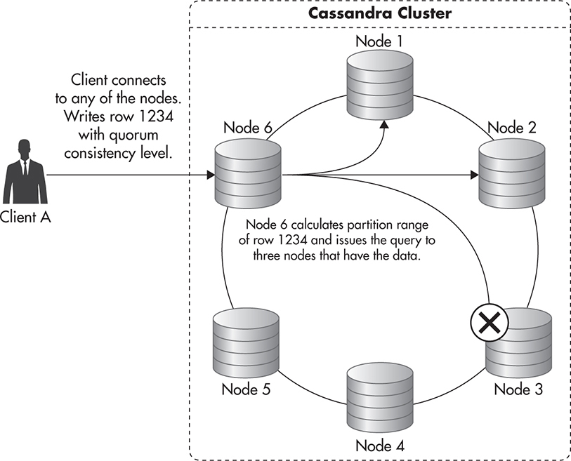

# DataStore

  * [Performance](#performance)
  * [Replication](#replication)
    + [Binary logs and two-phase commits](#binary-logs-and-two-phase-commits)
    + [Why](#why)
    + [How](#how)
    + [Trics](#trics)
    + [High Availability](#high-availability)
  * [Sharding](#sharding)
    + [Pros](#pros)
    + [Challenges](#challenges)
  * [NoSQL](#nosql)

## SQL vs NoSQL
1. SQL
    * Pros
        * stores data in uniform way, so that you could query anything
        * data is consitent in the meaning of relations
        * no dublicated data => easy to update
    * Cons
        * challenging to scale horizontally
1. NoSQL
    * Pros
        * easy to scale horizontally
    * Cons
        * there is data dublication
        * data ara not stored in uniform way, that means that you are restricred in the variety of queires you can perform
        * some queries will be very heavy, especially "join-like". And most of the NoSQL engines does not supports joins
1. Usually if you don't need scale it's better to use traditional SQL database

## Performance
1. General advice
1. It's worth to pay attention on **Active Dataset size** - it's the size of most used data. For example, there could be 1TB data in total, but only 1GB is used actively. It means, that if this 1G could be placed into memory - we won't ever read from disk.

## Replication

    

### Binary logs and two-phase commits
1. All the writes which go to database at first are written to the binlog file
1. Binlog file could be:
    * Statement based (like INSERT INTO....)
        * the downside of this type of replication that not all the statements produce identical results on master and slave. So developers and DBAs need to pay attention on this
    * Row-Based - the actual changes are replicated.
        * **+** all the operations are supported
        * **-** the size of binary log is much bigger (especially for write intensive applications, when writes happens in batches)
1. The advantages of this approach:
    * Without binary logs we would need to flush database page(s) on disk (to prevent data lost in case of failure) for every write. That means having a lot of random IO. Random IO is not very fast for HDD disks (most of the deployments uses HDD because of higher throughput, capacity and reliability)
    * With binary log enabled: we flush changes to binlog (sequential IO) and update page data in memory (making this page durty). As a result we have a lot of sequential IO, and significantly less amount of random IO.
    * Binarylog allows to perform replication and point in time recovery.

### Why
1. To scale reads
1. To perform no-downtime maitanance
    * perform updates on slaves
    * promote slave to master (???)
    * perform update on old slave

### How
1. A slave maintains `relay log` - the applied binary log from the master.
1. A slave knowns the master IP and queiries it for the changes in binlog file since the last sync.
1. When there are changes slave downloads them and applies.

### Trics
1. Applying replication changes is performed in single thread on slaves. That's why making big changes (like Alter Table) could introduce a big temporary replication lag.
1. Developers should pay attention on replication lag

### High Availability
1. To restore failed slave we need to first restore backup.
    * we can not start slave with empty database
    * if the difference between backup and actual state of the master is big - slave will be very busy trying to reach master
1. Replication is not a backup!
    * if we made incorrect changes to master - they will be replicated to slaves
    * when master failes we will lose all the data in range [last_sync_point:last_update]
1. To improve availability and decrease Recovery Time Objective we could setup master-master replication.
    * It's easier to perform maintanance in this case
    * Although it's possible to perform writes on both masters - it's not recomended. Because of the complexity of this setup and complexity of handling the conflicts
    * In case when we have only one master for writes we could easily switch to another master in case of failure.

    

### Challenges
1. Replication lag
1. Increased complexity
1. No built-in support for restoring from failure

## Sharding
1. **Sharding** it is data partitioning by some predefined partition keys and rules.
    * for example we could place every user with odd id in database 1 and every user with even id with database2

    

### Pros
1. With sharding we could implement horizontal scalability of our reads and writes, in addition to this we could partition data, and as a result the number of data that we store depends on the number of servers, but not the size of the server.

### Challenges
1. Developers should have knowledge on how to choose partition key and how to work correctly with shared data
1. It's become challenging (or sometimes impossible) to perform aggregation queries between shards
1. It's very difficult to reshard data - for example at the begginning you had 2 shards, but now to fullfill all the requirements you need 4 shards. So it's very difficult to reshard data on life servers with simple setup. There are two ways to handle resharding:
    * Have separate database, which is responsible for storing and providing connectivity between entity id and shard id
    * Prepare shards in advance
        * Estimate the amount of data that you will have
        * How many shards do you need to maintain this amount of data (for example we have 16)
        * Create a separate database for every future shard (so we have 16 databases in total)
        * Put all this databases into the minimun amount of servers (for example 2 servers with 8 databases each)
        * When you need to scale horizontally just move some databases to another servers

## Replication and Sharding example

## NoSQL

### Cassandra
1. All nodes in a Cassandra cluster are functionally equal. Clients can connect to any of Cassandra's nodes, and when they connect that node becomes the client's session coordinator. Clients do not need to know which nodes have what data, nor do they have to be aware of outages, repairing data, or replication.
1. Read
    

1. Write
    
