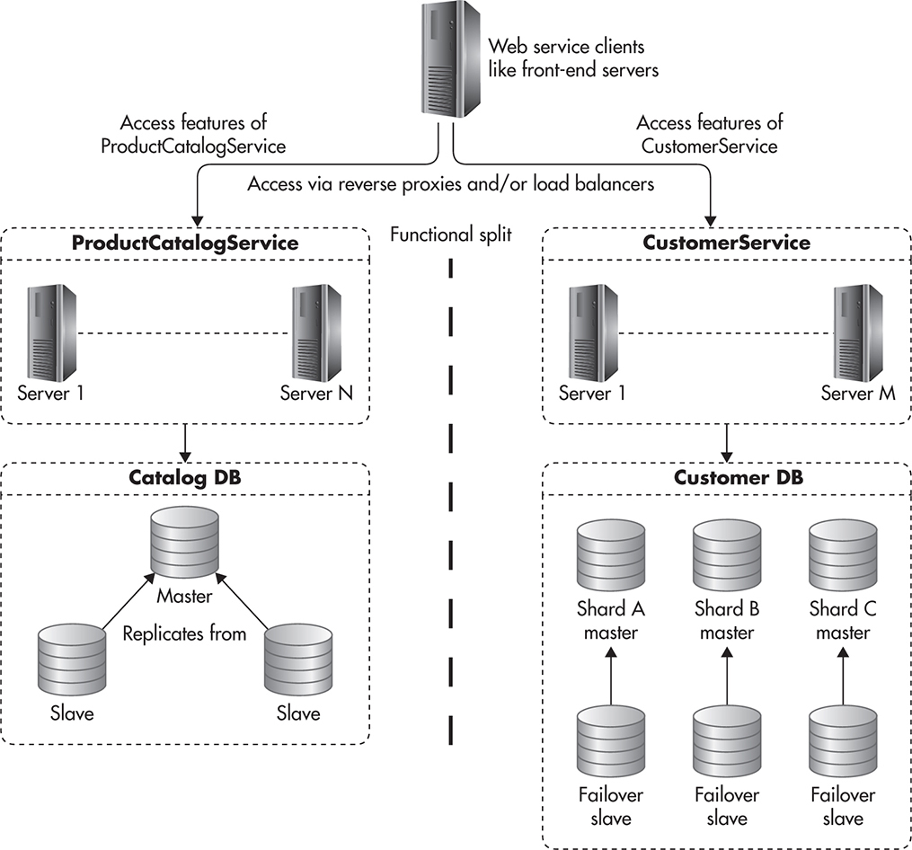

# Data Partition

## Types
1. Horizontal
    * split similar data into multiple databases
1. Vertical (or functional)
    * store users in one database, store orders in another database
1. Directory
    * have a specific service which maintains key=>partition link

## Partition Criteria
1. Round-robin (modulo) - key (or key hash) % number of shards
    * Pros:
        * easy to implement
    * Cons:
        * adding new partition requires to move add data
        * no sorting
1. Key Range - when the whole key range is divided by the number of partitions, and each partition gets it's own key range.
    * Pros:
        * easy to add new partition (especially with usage of Consistent Hashing)
        * can sort by key range
    * Cons:
        * it's very challenging to get uniform distribution with such partition strategy
1. Hash Range
    * Pros:
        * easy to add new partition (with consistent hashing)
        * uniform data distribution
    * Cons:
        * not sorting

## Challenges
1. Increased complexity on infrastructure and application level.
1. **Joins** - with partition data you can not make joins on database layer. The only thing you can do is query all the data in app memory and perform join inside application layer.
    * One of the solution of joins problem is to denormolize data
1. **Aggregation** - aggregation between shards in some cases challenging, in some cases impossible.
1. **Referal ingerity** (foreign keys) - we will loose this feature.
1. **Queryin secondary indexes** requires hitting every shard
1. **Schema changes** is nightmare
1. It's very **difficult to repartition** data - for example at the begginning you had 2 shards, but now to fullfill all the requirements you need 4 shards. So it's very difficult to reshard data on life servers with simple setup. There are two ways to handle resharding:
    * Have separate database, which is responsible for storing and providing connectivity between entity id and shard id
    * Prepare shards in advance
        * Estimate the amount of data that you will have
        * How many shards do you need to maintain this amount of data (for example we have 16)
        * Create a separate database for every future shard (so we have 16 databases in total)
        * Put all this databases into the minimun amount of servers (for example 2 servers with 8 databases each)
        * When you need to scale horizontally just move some databases to another servers

## Replication and Sharding example

