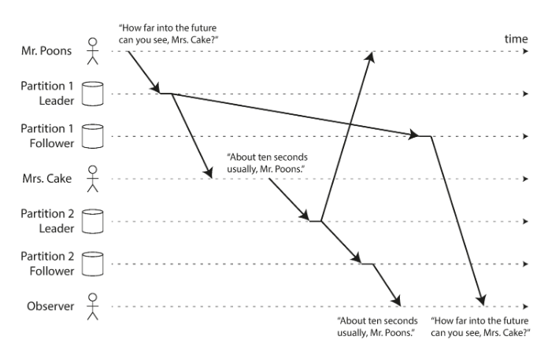
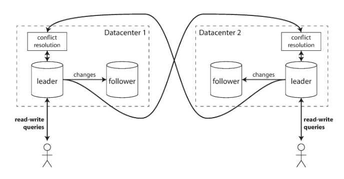

# Replication

## Use Cases
1. Scale read requests horizontally
1. Increase availability
    * failover
    * no downtime updates and maintanance
1. Keep data geographically close to users

## Types of replication
1. Single-Leader
1. Multi-Leader
1. Leaderless

## Leader and Followers
### General Idea

### Implementation
1. Writes go to the leader, then they are replecated (using binlog or wal) to followers
1. A slave maintains `relay log` the applied binary log from the master.
1. A slave knowns the master IP and queiries it for the changes in binlog file since the last sync.
1. The types of replication
    * **async** (default) - master doesn't know anything about slaves. Slave connect to master and stream binlog.
        * **+** good performance (we do not wait until slave apply this log)
        * **+** good availability (if slave is down master continue to work)
        * **-** bad durability (if master is down and we perform failover from slave - then we will lose data that wasn't streamed to this slave)
        **-** eventual consistency and stale reads
    * **sync** - master waits until all slaves apply changes
        * **+** strong consistency
        * **+** durability
        * **-** decrease in performance
        * **-** decrease in availability
    * **semi-sync** - the is one or more sync slaves and rest of them are async
1. Challenges in implementation:
    * in mysql slave applies queries in single thread (to avoid dealing with concurrency).
        * PostgreSQL it's not an issue, because most of the work slave perform is IO bound (physical replicaion)
        * it's an issue for MySQL, because most of the slave work is CPU bound (due to logical binlog format). So we need to pay attention and monitor at the replication lag. MySQL 5.7+ can update different tables in multiple threads. This way we decrease the influence of single-threaded apply.

### Setting up New Followers
1. Take a consistent shapshot of the leader's database
1. Copy snapshoot to the follower
1. Start follower, when follower connects to the leader it will stream and appply the difference between snapshoot and current state.

### Handling Node Outages
#### Follower Failure
1. Just spin up new folloer with the traditional steps

#### Leader Failure
1. One of the followers is choosen as new leader
1. Clients need to be reconfigured to send their writes to the new leader
1. Other followers need to start consuming data changes from the new leader

#### Challenges with Leader Failover
1. If we use authomatic failover we could wrongly detect leader as failed (for example when leader is overloaded on CPU and can not respond to queries). In this case after we perform failover process we could have two leaders. STONITH is required here to prevent **split brain**. Whan would happend if we apply big migration? In some cases, both nodes could be down.
1. If we use async replication the new leader may not have received all the writes from the old one. As a result we will lose data. It could be even more dangerous in case when external system depends on this data (for example Github issue with Redis and private repositories)
1. What is the right timeout before the leader is declared dead? If it's to high we will loose availability, if it's to low we will perform unnecessary failovers (it's especially dangerous when system struggling with highload or network problems, because we make them even worse).

### Implementation of replication logs
1. All the writes at first are written to the binlog file
1. Binlog (WAL) file could be:
    * Physical - contain phisical changes within pages
        * **+** byte-to-byte correspondence between leader and follower
        * **+** no additional CPU load on follower for performing statement
        * **-** very sensetive to database version changes. It's more difficult to perform update without downtime
    * Statement based (like INSERT INTO....)
        * **-** all the statements produce identical results on master and slave. As a result we could have different data on master and slave
    * Row-Based - the actual changes are replicated.
        * **+** all the operations are supported
        * **-** the size of binary log is much bigger (especially for write intensive applications, when writes happens in batches)
1. Binlog (WAL) advantages:
    * Without binary logs we would need to flush database page(s) on disk (to prevent data lost in case of failure) for every write. That means having a lot of random IO. Random IO is not very fast for HDD disks (most of the deployments uses HDD because of higher throughput, capacity and reliability)
    * With binary log enabled: we flush changes to binlog (sequential IO) and update page data in memory (making this page durty). OS then could decide when to flush this page on disk. As a result we have a lot of sequential IO, and significantly less amount of random IO.
    * Binarylog allows to perform replication and point in time recovery.

### Replication Lag
1. Reading your own writes - when you write something and immideately read it you get the old value. To prevent:
    * if user edited value read it only from master during some time
    * track the `updatedAt` field and read from master when `updatedAt` within some interval
1. Monotonic reads - the effect of moving back in time. For example there was a list with one element, someone added 1 more element to it. At the same time, you queiried that list and saw the result as 2 elements, then you queiried againg (request went to slave where changes were not applied) and you get the list with only one element.
    * one way of achieving monotonic reads it to make sure that each user always makes their reads from the same replica.
1. Consistent prefix read - happens in partitioned databases.
    

## Multi-Leader Replication
### General Idea

### Use Cases
1. You do not scale writes with multi-leader deployment. Because you still need to apply all changes to both masters!
1. Multi-Datacenter Operation
    * improve performance - backend talk only with database located in the same datacenter
    * tolerance of datacenter outages
    * tolerance of network problems - traffic between datacenters usually goes over the public internet, which is less reliable than local network. A single leader configuration is very sensitive to problem in this inter-datacenter link.
1. Clients with Offline Operation
    * mobile clients
    * remote clients where internet is not always available
    * collobarative editing (like google docs)

### Challenges
1. The biggest challenge in multi-master configuration is handling and resolution of conflicts. It's very difficult to implement right, so if possible avoid multi-leader configuration.

## Leaderless Replication
