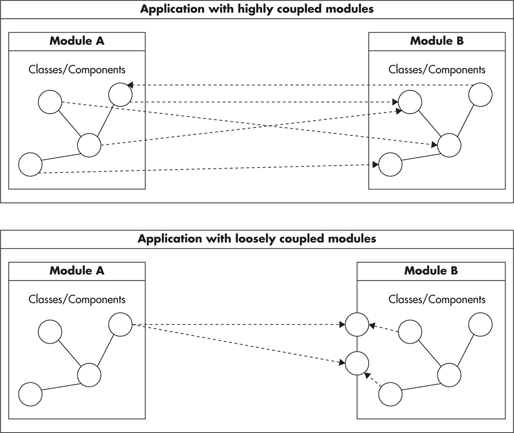

# Design

* [Reliability](#reliability)
* [Scalability](#scalability)
* [Maintainability](#maintainability)
* [Simplicity](#simplicity)
  + [Loose Coupling](#loose-coupling)
  + [Don't Repeat YourSelf](#dont-repeat-yourself)
  + [Coding to Contract](#coding-to-contract)
  + [Draw Diagrams](#draw-diagrams)
  + [Single Responsibility](#single-responsibility)
  + [Open-CLosed Principle](#open-closed-principle)
  + [Depenency Injection](#depenency-injection)
  + [Inversion Of Control](#inversion-of-control)
* [Design For Scale](#design-for-scale)
  + [Self Healing](#self-healing)

## Reliability
1. **Reliability** - the system should continue to work correctly (performing the correct function at the desired level of performance) even in the face of adversity (hardware or software faults, and even human error)
1. Works correctly means
    * The application performs the function that the user expected.
    * It can tolerate the user making mistakes or using the software in unexprected ways.
    * Its performance is good enough for the required use case, under the expected load and data value.
    * The system prevents any unauthorized access and abuse.
1. Types of adversities:
    * Hardware failure. Usually we use redundant hardware to deal with this kind of failure
    * Software Errors.
        * Examples:
            * A software bug that causes every instance of an application server to crash when given a particular bad input.
            * A runaway process that uses up some shared resources - CPU time, memory, disk space or network bandwidth
            * A service that system depends on that slows down, becomes unresponsive, or starts returning correpted responses
            * Cascading faulures, where a small fault in on component triggers a fault in another component, which in turn triggers futher faults
        * To deal with use:
            * thorough testing
            * process isolation
            * allowing processes to cras hand restart
            * measuring
            * monitoring
    * Human Errors.
        * To deal with:
            * Design systems in a way that minimizes opportunities for error.
            * Decouple the places where people make the most mistakes from the places where they can cause failures.
            * Test throughly at all levels, from unit to e2e and manual
            * Allow quick and easy recovery from human erros.
            * Setup detailed and clear monitoring, such as perormance metrics and error rates.
            * Implement good management practices and training

## Scalability
1. **Scalability** - as system grows (in data volume, traffic volume or complexity) there should be reasonable ways of dealing with that growth.

## Maintainability
1. **Maintainability** - over time, many different people will work on the system (engineering and operations, both maintaining current behavior and adapting the system to new use cases), and they should all be able to work on it productively.

## Simplicity
1. **The most important principle is keeping things simple.**
    * the simplier the system the easiers is to evolve, maintain and optimize.
1. **Hide Complexity and Build Abstractions**
    * hide complexity behind simple API
    * keep modules small and understandable
1. **Avoid Overengineering** -  do not try to predict every possible case how you software will be used. Good design allows you to add more details and features later on, but does not require you to build a massive solution up front.
1. Try TDD - in addition to testability you will gain the view on your system from customer point of view

### Loose Coupling
1. Decrease the amount of connection between your modules and services.
    
1. Avoid unnecessary coupling
    * don't make anything public unless it's really required
    * prevent the necessety of having knowledge on which order your API method should be used
    * avoid circular depencencies and try to make things hierarchical

### Don't Repeat YourSelf
1. Following an inefficient process (e.g. timewasting meetings)
1. Lack of automation
1. Copy-Paste programming
1. Do not repeat someone else (try to use existed solution instead of building your own)

### Coding to Contract

### Draw Diagrams

### Single Responsibility

### Open-CLosed Principle
1. Code should be open for extension and closed for modification. It means that code should be able to support new features without extensions
1. Good example is taking compare function as an argument of sort function

### Depenency Injection

### Inversion Of Control

## Design For Scale
1. Adding more clones
1. Functional Partitioning
1. Data Partitioning

## Self Healing
1. System is never up, it's always particially down
1. Draw the system diagram and identify **Single Points of Failure**
1. Evaluate if it worths to add redundancy level to SPF
