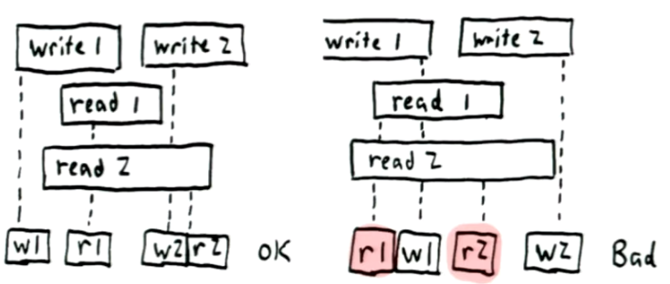

## Distributed Systems

### CAP
1. It's impossible to achive **Consistency**, **Availability** and **Network Paritition Tolerance** at the same time.

    
1. **Linearizability** (consistency in CAP) - (simple explanation) when all writes looks like they processed immideately.
    * once write completes, all later reads should return the value of that write or the value of a later write
    * once a read returns a particular value, all later reads should return that value or the value of a later write.
    

1. **Serializability** (I in ACID) - is a gurantees that the execution of a set of transactions over multiple items is equivalent to some serial execution of the transactions.

## Challenges
1. Unreliable network with variable delays
1. Partial failures
1. Unreliable Clocks
1. Processing pauses
