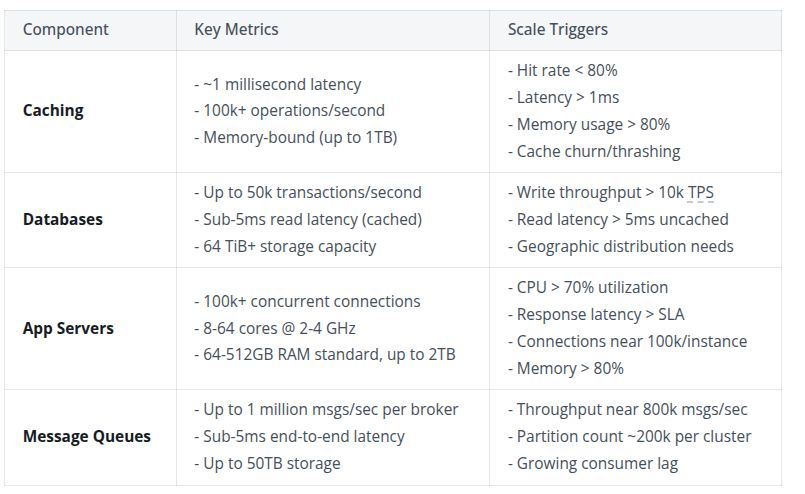

# System Design

* TOC
{:toc}

## Delivery Framework

### 1. Requirements (~5 min)

####  Functional

Identify and prioritize top 3-5 requirements, as you can't build a design with 100+ during 1h interview

#### Non-Functional
Should be in form of `The system should be...`

Choose from:
* **CPA Theorem** - consistency or availability?
* **Environment Constraints** - e.g. if it runs on mobile devices with battery and network constraints
* **Scalability** - does it have uniq scaling requirements? e.g. traffic burst on specific days. What scales more reads or writes?
* **Latency** - how fast should be different types of requests
* **Durability**
* **Security** - data protection, access control, compliance and regulations
* **Fault Tolerance** - redundancy, failover and recovery mechanisms
* **Compliance** - are the legal or regulatory requirements the system needs to meet. Industry standards, data protection laws, etc

Examples:

```
The system should be highly available, prioritizing availability over consistency
The system should be able to scale to support 100M+ DAU (daily active users)
The system should be have low latency, rendering feeds in under 200ms
```


#### Capacity Estimation

https://www.hellointerview.com/blog/mastering-estimation
https://www.hellointerview.com/learn/system-design/core-concepts/numbers-to-know

### 2. Core Entities (~2 min)

List core entities of your system. This will help to define terms, understand data and some naming.

Ask yourself:
* Who are the actors in the system?
* What are the nouns or resources necessary to satisfy the functional requirements?

E.g. for twitter it would be:
* User
* Tweet
* Follow

### 3. API or System Interface (~5 min)

Choose form
* **REST**
* **GraphQL** - allow clients to specify exactly what data they want to receive, avoiding over-fetching and under-fetching. Choose this when you have diverse clients with different data needs
* **RPC** - action-oriented protocol (like gRPC) that's faster than REST for s2s communication. Use for internal APIs when performance is critical.

### 4. Data Flow (~5 mins) [Optional]

For some backend systems, especially data-processing systems, it can be helpful to describe the high level sequence of actions or processes that the system performs on the input to produce desired output.

E.g. for a web crawler, it will be
1. Fetch seed URLs
2. Parse HTML
3. Extract URLs
4. Store data
5. Repeat

### 5. High Level Design (~10-15 mins)

Build MVP. Focus on **functional** requirements first, mention moments which need improvement later.

### 6. Deep Dive

Harden your design by:
* Meeting **non-functional** requirements
* Addressing edge cases
* Identifying and addressing issues and bottlenecks
* Observability, maintenance, cost
* Improving the design based on probes from your interviewer

**LISTEN. Make sure you give your interviewer room to ask questions and probe your design. Chances are they have specific signals they want to get from you and you're going to miss it if you're too busy talking. Plus, you'll hurt your evaluation on communication and collaboration.**

## Numbers


