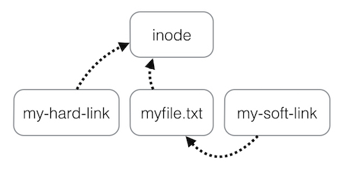

# File System

- [Common](#common)
- [File system](#file-system)
- [File management commands](#file-management-commands)
- [Механизмы владения файлами](#%D0%BC%D0%B5%D1%85%D0%B0%D0%BD%D0%B8%D0%B7%D0%BC%D1%8B-%D0%B2%D0%BB%D0%B0%D0%B4%D0%B5%D0%BD%D0%B8%D1%8F-%D1%84%D0%B0%D0%B9%D0%BB%D0%B0%D0%BC%D0%B8)
- [Продвинутое управление правами доступа](#%D0%BF%D1%80%D0%BE%D0%B4%D0%B2%D0%B8%D0%BD%D1%83%D1%82%D0%BE%D0%B5-%D1%83%D0%BF%D1%80%D0%B0%D0%B2%D0%BB%D0%B5%D0%BD%D0%B8%D0%B5-%D0%BF%D1%80%D0%B0%D0%B2%D0%B0%D0%BC%D0%B8-%D0%B4%D0%BE%D1%81%D1%82%D1%83%D0%BF%D0%B0)
- [Списки контроля доступа](#%D1%81%D0%BF%D0%B8%D1%81%D0%BA%D0%B8-%D0%BA%D0%BE%D0%BD%D1%82%D1%80%D0%BE%D0%BB%D1%8F-%D0%B4%D0%BE%D1%81%D1%82%D1%83%D0%BF%D0%B0)
- [Ссылки на файлы](#%D1%81%D1%81%D1%8B%D0%BB%D0%BA%D0%B8-%D0%BD%D0%B0-%D1%84%D0%B0%D0%B9%D0%BB%D1%8B)

## Common
1. ["On a UNIX system, everything is a file; if something is not a file, it is a process."](http://www.tldp.org/LDP/intro-linux/html/sect_03_01.html)
1. File extension does not play any role.

## File system
1. To get help about linux file system use
    ```
    man hier
    ```
1. [File system description [rus]](https://stepik.org/lesson/28949/step/2?course=%D0%9E%D1%81%D0%BD%D0%BE%D0%B2%D1%8B-Linux&unit=9961)

## File management commands
1. Special symbols
    * **`/`** - top level directory
    * **`.`** - current directory
    * **`..`** - parent directory
    * **`~`** - home directory

1. **`touch`** - create a file

1. List files - **`ls`**
    * **`ls dir`** - list contens of dir
    * **`ls -l`** - list in long format
    * **`ls -a`** - list all files
    * **`ls -R`** - recursively list files in subdirectories
    * **`ls -d`** - don't go into subdirectories, just list them
    * **`ls -S`** - list by size
    * **`ls -t`** - list by modification date
    * **`ls -lh`** - list files in long format with human-readable size
    * **`ls -F`** - list files and gets their types

1. Copy files - **`cp`**
    * **`cp a b`** - copy file **a** to **b**
    * **`cp a b c dir/`** - copy files **a b c** into **dir/**
    * **`cp -R old new`** - recursively copies directory old into new
    * **`cp -i a b`** - ask before overwriting files

1. **`mkdir`** - create directory
    * **`mkdir -p`** - create directory recursively

1. **`file`** - get info about file

1. **`mv`** - rename file

1. **`rename`** - rename files according to template
    * change all `.txt` files extensions to `.png`
        ```bash
        rename 's/\.txt/\.png/ *.txt
        ```

1. **`find`** - поиск и обработка файлов рекурсивно
    * поиск всех файлов в директории рекурсивно
        ```bash
        find /etc
        ```

    * Поиск только файлов
        ```bash
        find . -type f
        ```

    * Поиск всех файлов с расширением `.conf`
        ```bash
        find . -name "*.conf"
        ```

    * Поиск всех файлов и копирование их в по заданному пути
        ```bash
        find /data -exec cp {} /backup/ \;
        ```

    * **-iname** - case insencetive search
        ```bash
        find / -iname "test.txt"
        ```

    * **-not** - reverse search
        ```bash
        find / -not -name "test.txt"
        ```

    ** **-size** - specify file filter
        ```bash
        find /usr/bin -size +27000c #finds all file with size > 27000b
        ```

        * `c` - bytes
        * `k` - kilo bytes
        * `M` - mega bytes


    * **-mtime** - filter by creation day
        ```bash
        find / -type f -mtime 1
        ```

    * **-user** - filter by user
    * **-perm** - filter by permission
    * **-exec** - exec command on found files
        ```bash
        find / -name "test.txt" -exec chmod 700 {} \;
        ```

1. **`locate`** - поиск файлов используя данные индексирования файловой системы. Эта утилита гораздо быстрее find, но может вернуть устаревшие данные. Для того чтобы обновить индексы нужно вызвать `updatedb`. В большинстве систем Linux утилита `updatedb` запускатся один раз в день.

1. **`df`** - show disk partitions

    * show in human readable format
        ```bash
        df -h
        ```

## Механизмы владения файлами
1. **`ls -l`** посмотреть права доступа к файлам
    ```bash
    $ ls -lh /home
    drwxr-xr-x 53 max  max  4,0K авг.  30 09:59 max
    ```

    * `drwxr-xr-x` - права доступа
        * **d**rwxr-xr-x - тип файла
        * d**rwx**r-xr-x - права доступа для обладателя файла
        * drwx**r-x**r-x - права доступа для группы обладателя фалйа
        * drwxr-x**r-x** - права доступа для всех остальных
    * `max` (3 колонка) - обладатель файла
    * `max` (4 колонка) - группа обладателя файла

1. Типы файлов

    | Первый символ | Тип файла |
    | --- | --- |
    | - | Обычный файл |
    | d | Директория |
    | l | Символьная ссылка |
    | p | Именованный канал |
    | b | Блочное устройство |
    | c | Символьное устройство |
    | s | Сокет |

1. Стандартные права доступа к файлам Unix

    | Право доступа | К файлу | К директории |
    | --- | --- | --- |
    | r (чтение) | Чтение содержимого файла (`cat`) | Чтение содержимого директории (`ls`) |
    | w (запись) | Изменение содержимого файла (`vi`) | Создание файлов в директории (`touch`) |
    | x (исполнение) | Исполнение файла | Вход в директорию (`cd`) |

1. **`chmod`** - устанавливает права доступа
    ```bash
    $ ls -l
    total 0
    -rw-rw-r-- 1 paul paul 0 Sep  3 08:23 permissins.txt
    $ chmod u+x permissins.txt
    $ ls -l
    total 0
    -rwxrw-r-- 1 paul paul 0 Sep  3 08:23 permissins.txt
    ```
    * **`+`** - добавляет право доступа, **`-`** - убирает право доступа, **`=`** - устанавливает права доступа (`u=rw`)
    * **`u+(r|w|x)`** - добавляет право доступа для пользователя владельца
    * **`g+(r|w|x)`** - добавляет право доступа для группы владельцев
    * **`o+(r|w|x)`** - добавляет право доступа для все пользователей, которые не являются ни владельцем ни группой владельцев
    * **`+(r|w|x)`** - добавляет право доступа для всех пользователей (владелец, группа владельцев, остальные пользователи)
    * **`chmod oct_ode filename`** - устанавливает права доступа в соответствии с восьмиричным представлением

        | Двоичное представление | Вольмеричное представление | Права доступа |
        | --- | --- | --- |
        | 000 | 0 | --- |
        | 001 | 1 | --x |
        | 010 | 2 | -w- |
        | 011 | 3 | -wx |
        | 100 | 4 | r-- |
        | 101 | 5 | r-x |
        | 110 | 6 | rw- |
        | 111 | 7 | rwx |

        ```bash
        # set to rwxrwxrwx
        $ chmod 777 permissions.txt
        $ ls -l permissions.txt
        -rwxrwxrwx 1 paul paul 0 2007-02-07 22:34 permissions.txt
        ```
1. **`chgrp groupname filename`** - изменяет группу пользователей, владеющей файлом
1. **`chown username filename`** - изменяет пользователя владельца файла
    * **`chown groupname:username filename`** - изменяет группу и пользователя одновременно.
1. **`mkdir -m oct_code dir_name`** - создаёт папку и устанавливает право доступа
    ```bash
    $ mkdir -m 700 MyDir
    $ mkdir -m 777 Public
    $ ls -dl MyDir/ Public/
    drwx------ 2 paul paul 4096 2011-10-16 19:16 MyDir/
    drwxrwxrwx 2 paul paul 4096 2011-10-16 19:16 Public/
    ```
1. **`cp -p`** - скопировать файлы и сохранить уровень доступа

## Продвинутое управление правами доступа
1. bit `sticky` может быть установлен для директории с целью предотвращения удаления файлов пользователями, которые не являются их непосредственными владельцами. отображается как `t` на месте символа `x`
    ```bash
    $ ls -l
    drwxrwxr-x 2 u1 u1 4096 Sep  4 01:26 projects
    $ chmod +t projects
    $ ls -l
    drwxrwxr-t 2 u1 u1 4096 Sep  4 01:26 projects
    ```

    * bit `sticky` может быть так же установлен в случае использования восьмеричного значения прав доступа, причём в этом случае должно использоваться двоичное значение 1 в первом из четерёх триплетов.

        ```bash
        chmod 1775 projects
        ```
1. bit `setgid` может устанавливаться дли директории в тех случаях, когда необходимо, чтобы в качестве группы пользователей, владеющей файлами в директории, использовалась группа пользователей владеющая директорией. Отображается с помощью символа `s`. Устанавливается с помощью команды `chmod 2xxx`.
    ```bash
    $ groupadd g1
    $ mkdir proj
    $ chown root:g1 proj
    $ ls -l
    drwxr-xr-x   2 root g1   4096 Sep  4 01:48 proj
    $ chmod 2775 proj
    $ touch proj/f1
    $ ls -l proj
    -rw-r--r-- 1 root g1 0 Sep  4 01:49 f1
    ```

    * если установлен бит `setgid` то при запуске файла он будет с правами пользователей из группы владеющей файлом.
1. `setuid` - позволяет запускать файл от лица его создателя, а не от лица текущего пользователя.

## Списки контроля доступа
1. Чтобы файловая система поддерживала _механизм списков контроля доступа_ она должна монтироваться с использованием параметра `acl` в файле `/etc/fstab`.
1. **`getfacl`** - получает _список контроля доступа_ для файла
    ```bash
    $ getfacl file33
    # file: file33
    # owner: paul
    # group: paul
    user::rw-
    group::r--
    mask::rwx
    other::r--
    ```
1. **`setfacl`** - устанавливает список контроля доступа
    * **`setfacl -m u:username:binarycode filename`** - добавляет право доступа для пользователя
        ```bash
        $ setfacl -m u:sandra:7 file33
        ```

    * **`setfacl -m g:groupname:binarycode filename`** - добавляет право доступа для группы
        ```bash
        $ setfacl -m g:tennis:6 file33
        ```

    * результат описанных выше операций:
        ```bash
        $ getfacl file33
        # file: file33
        # owner: paul
        # group: paul
        user::rw-
        user:sandra:rwx
        group::r--
        group:tennis:rw-
        mask::rwx
        other::r--
        ```

    * **`setfacl -x username|groupname filename`** - удаляет право доступа
        ```bash
        setfacl -x sandra file33
        getfacl file33 | grep sandra
        ```

    * **`setfacl -b filename`** - удаление всего списка доступа

1. _Маска прав списка контроля доступа_ описывает максимальные эффективные права доступа для любого из элементов этого _списка_. Данная _маска_ рассчитывается каждый раз, когда вы используете утилиту `setfacl` или `chmod`. Для предотвращения перерасчёта _маски_ нужно воспользоваться параметром `--no-mask`
    ```bash
    $ setfacl --no-mask -m u:sandra:7 file33
    $ getfacl file33
    # file: file33
    # owner: paul
    # group: paul
    user::rw-
    user:sandra:rwx                 #effective:rw-
    group::r--
    mask::rw-
    other::r--
    ```

## Ссылки на файлы
1. Метаданные файла (параметры файла, права доступа, дата создания и т.д.) содержатся в структуре `inode`. Кроме метаданных в `inode` хранится ссылка на данные файла.
1. Количество `inode` ограниченно и можно посмотреть с помощью команды
    ```bash
    df -i
    ```
1. **`ls -li`** - просмотр идентификатора `inode`.
    ```bash
    $ touch f1
    $ ls -li
    total 0
    5250474 -rw-rw-r-- 1 max max 0 сент.  7 08:01 f1
    ```

    * 5250474 - идентификатор
1. _Директория_ является особым видом файла, который содержит таблицу соответствия между именами файлов и структурами `inode`. При выводе списка содержимого директории на самом деле осуществляется вывод содержимого файла директории.

1. **`ln file hard_link`** создаёт _жесткую ссылку_ на файл. В момент создания жесткой ссылки в файл директории добавляется дополнительная запись. Новое имя файла ставится в соответствие существующей структуре inode. Оба файла будут использовать одну и ту же структуру inode, поэтому они в любом случае будут иметь одни и те же права доступа, а также одного и того же владельца. Оба этих файла также будут иметь одно и то же содержимое. На самом деле, оба этих файла будут идентичными и это означает, что вы можете безопасно удалить оригинальный файл и это никак не повлияет на существование файла, являющегося жесткой ссылкой.

1. **`ln -s file soft_link`** - создаёт _символьную ссылку_. При создании символьной ссылки созадётся новый файл указывающий на имя ссылаемого файла.

1. Разница между _жесткой_ и _символьной_ ссылкой.
    
