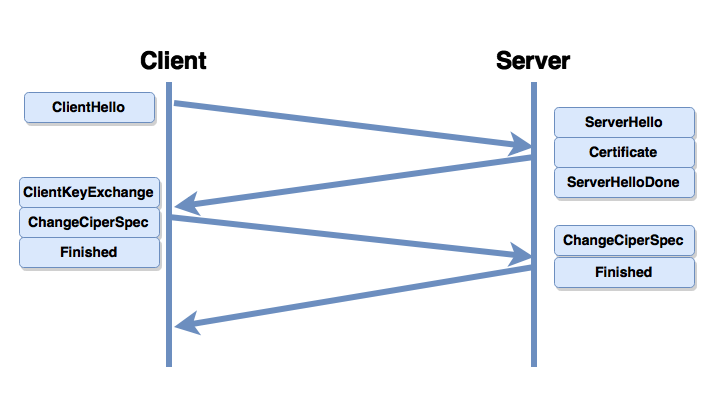

# TLC

## Table of content
- [Common](#common)
- [Установка TLS соединения](#установка-tls-соединения)
- [Минусы TLS соединения](#минусы-tls-соединения)

## Common
1. **`TLC`** - криптографический протокол, обеспечивающий безопасную передачу данных между хостами в Internet
1. Функции:
    * Аутентификация сервера и клиента. Т.е. то что мы подсоединились реально к тому серверу к которому планировали подсоединиться
    * Шифрование и сжатие передаваемой информации
    * Защита от подмены и проверка целостности сообщений. К примеру мы передали данные, злоумышленник не может их расшифровать, т.к. они зашифрованны, но при этом он мог бы дописать свои данные не будь у нас проверки целостности.

## Установка TLS соединения
* Устанавливается после устновки `TCP` соединения и передаёт свои сообщения по нему.

1. `ClientHello` - клиент указывает желаемые опции соединения.
1. `ServerHello` - сервер подтверждает опции соединения.
1. `Certificate` - сервер посылает клиенту свой сертификат.
1. Клиент проверят сертификат. На данном этапе соединение может быть отключено.
1. `ClientKeyExchange` - клиент отправляет серверу ключ симметричного шифрования (или параметры для его генерации). Один и тот же ключ генерируется как на клиенте так и на сервере, причём без передачи этого ключа по сети.
1. `Finished` - сервер подтверждает завершение рукопожатия.

## Минусы TLS соединения
1. Нужно как минимум 2 round trip time + время на проверку сертификата.
