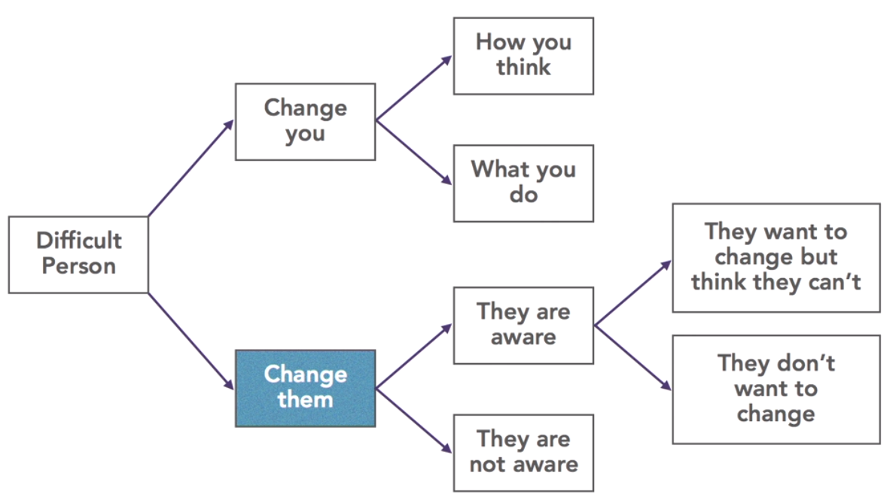

# Dealing with Conflicts

## Levels of Difficult People
1. Different to Me
    * Signs:
        * faster/slower than me at work
        * take more/less risk at work
        * see things differently
        * more/less emothional
        * control kids more/less then necessary
    * Solution
        * if difference is the **only** problem, then just allow them live as they are, we are all different and it's great
1. Incompetent
    * Signs
        * not very disciplined
        * not very organized
        * not very decisive
        * a bit low on communication skills and emphaty
    * Solution
        * What gaps do they have?
        * How can you adapt?
        * What gaps you may have?
1. Toxic
    * Signs
        * problems with everyone
        * critical (may be in a form of advice)
        * selfish and bad listeners
        * liar
        * time and energy consuming
        * make small things into dramas
        * they always seem to be a victim
    * Solutions
        * it's not their fault, they are most likely impacted by bad upbrigning, bad management or just bad luck
        * do not try to change them or persuade them
        * avoid dealing with them at all cost

## Tactics and Techniques

* Change youself
    * do I really care?
        * change what I think
    * can I do something to remediate?
        * change what I do
* Change someone else - always more difficult and with less change to success
    * make them aware
    * make them want to change

## Dealing with Agressive People

### Modern Forms of Aggression
1. Interrupting
1. Patronising
1. Ignoring
1. Stereotyping
1. Body language
    * eye rolling
1. Criticising someone behind their back
1. Not inviting someone to a meeting
1. Sulking
1. Bearing grudges

### Strategies
There could be two ways to deal with them
1. Find a way to live with this behavior
    * Practice detachment - I won't be feeling bad about myself because of their words / actions
    * Resist caving in or being aggressive back - accept their point of view, but don't give up.
    * Set clear objectives and calmly stick to them
    * Take time out
2. Change them
    * Point out their behavior and explain how you'd like to work instead.
    * Follow the framework:
        * I understand
        * I feel
        * I want
        * Is that OK?
