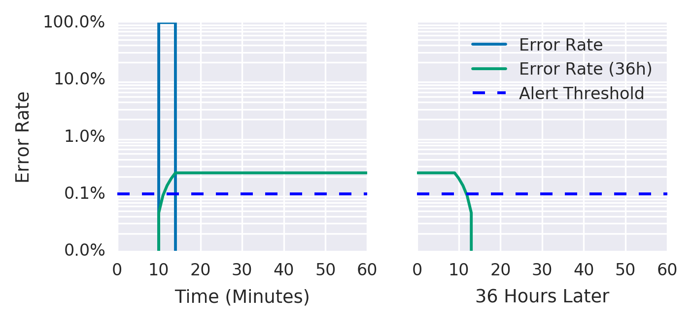
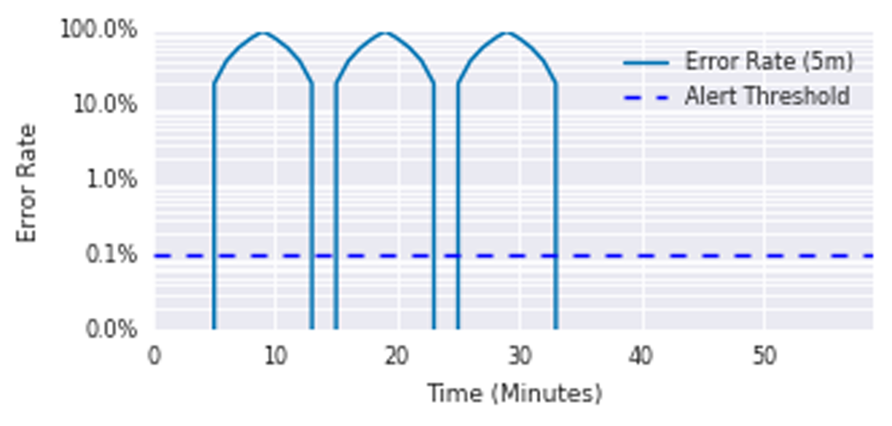
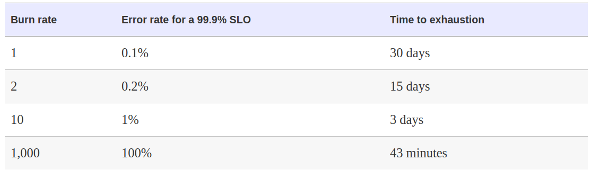
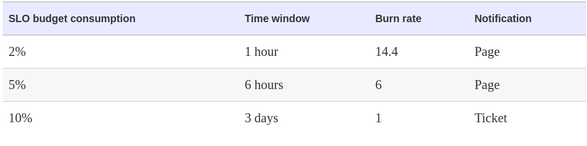
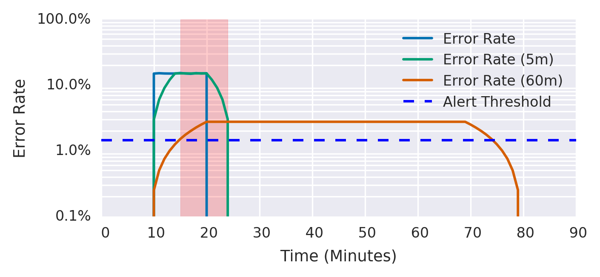

# Alerts
 * [Philosophy](#philosophy)
    + [Best Practices](#best-practices)
    + [Minimize the amount of alerts](#minimize-the-amount-of-alerts)
    + [Alerting Consideration](#alerting-consideration)
 * [Strategies](#strategies)
    + [EWMA](#ewma)
    + [SLO](#slo)
    + [Target Error Rate >= SLO Threshold](#target-error-rate--slo-threshold)
    + [Increased Alert Window](#increased-alert-window)
    + [Alert duration](#alert-duration)
    + [Alert on a Burn Rate](#alert-on-a-burn-rate)
    + [Multiple burn rate alerts](#multiple-burn-rate-alerts)
    + [Multi-window, Multi-Burn-Rate](#multiwindow-multi-burn-rate)

## Philosophy

### Best Practices
1. Don't use emails for alerts. Depending on the criticality send alert to:
    * Response/action required immediately - send this to pager, phone, Pager Duty, etc.
    * Awareness needed, but immediate action not required - send it to the chat.
    * Record for historical/diagnostic purpose - send it to log system.
1. Every alert should have an owner.
1. Log all alerts and remediation time for analysis.
1. Every alert should have attached runbook for an on-call engineer. Runbook content:
    * What is this services, and what does it do?
    * Who is responsible for it?
    * What dependencies does it have?
    * What does the infrastructure for it look like?
    * What metrics and logs does it emit, and what do they mean?
    * What alerts are set up for it, and why?
1. Every page should be actionable.
1. Every page response should require intelligence. If a page merely merits a robotic response, it shouldn't be a page.
1. Pages should be about a novel problem or an event that hasn't been seen before.
1. Alerts should not flap.
1. One event should trigger as less alerts as possible.
    * When there are a lot of triggered alerts in case of an incident - it creates a lot of noise and complicates troubleshooting.
1. **Test your alerting system** - as you setup your monitoring system you could not be fired by an alert for months or years, so it's very important to be sure over time that your alerts are not broken.

### Minimize the amount of alerts
1. Every time the pager goes off, I should be able to react with a sense of urgency. I can only react with a sense of urgency a few times a day before I become fatigued.
1. Does this rule detect an otherwise undetected condition that is urgent, actionable, and actively or imminently user-visible?
1. Will I ever be able to ignore this alert, knowing it fires? When and why will I be able to ignore this alert, and how can I avoid this scenario?
1. Does this alert definitely indicate that users are being negatively affected? Are there detectable cases in which users aren't being negatively impacted, such as drained traffic or test deployments, that should be filtered out?
1. Can I take action in response to this alert? Is that action urgent, or could it wait until morning? Could the action be safely automated?
1. Does everyone from the notification list really need to be notified?


## Tips
1. For batch jobs is good to have a simple alert on the last successful run.


### Alerting Consideration
1. **Precision** - proportion of the alerts which correspond to the real outage
    ```
    precision = real incidents triggers / all alerts trigger
    ```

1. **Recall** - the proportion of significant events detected
    ```
    recall = detected significant events / all significant events
    ```

1. **Detection time** - how long does it take to send notification in various conditions.

1. **Reset time** - how long does alert fires after issue has been mitigated.

## Tools

### EWMA
1. **E**exponentially **W**eighed **M**oving **A**verage

### SLO
```yaml
record: job:slo_errors_per_request:ratio_rate10m
expr:
  sum(rate(slo_errors[10m])) by (job)
    /
  sum(rate(slo_requests[10m])) by (job)
```

## Strategies
### Target Error Rate >= SLO Threshold
1. Rule

    ```yaml
    - alert: HighErrorRate
      expr: job:slo_errors_per_request:ratio_rate10m{job="my_job"} >= 0.001
    ```
1. Pros and cons
    * **+** Good Recall. All the significant events are detected
    * **+** Good Detection Time. Once we consumed 10-minutes error budget the alert will fire
    * **+** Good Reset Time. Alert will stop firing once the windows is over (10 min)
    * **-** Extremely bad precision.

### Increased Alert Window
1. Rule

    ```yaml
    - alert: HighErrorRate
       expr: job:slo_errors_per_request:ratio_rate36h{job="my_job"} > 0.001
    ```

1. Pros and cons
    * **+** Still good recall.
    * **+** Still good detection time.
    * **+** Good precision. Because we will trigger the alert once the 36hours error budget is spent.
    * **-** Very bad reset time. Once fired alert will continue firing during the whole window

    

### Alert duration
1. Rule

    ```yaml
    - alert: HighErrorRate
      expr: job:slo_errors_per_request:ratio_rate1m{job="my_job"} > 0.001
      for: 1h
    ```

1. Pros and cons
    * **+** Good precision.
    * **+** Good reset time.
    * **-** Extremely Bad Recall. If significant event last less than an hour we won't trigger it. As a result we could spend all our error budget without triggering alert.
    * **-** Very bad detection time (1h).

    

### Alert on a Burn Rate
1. **Burn Rate** is how fast, relative to SLO, service consumes error budget.

    

1. If we set a window (1h) and the amount of budget that we could spend (e.g. 5%) we could setup a pretty good alert if the burn rate is more than 5% in 1 hour window.
    * 5% of monthy error budget = 720h * 0.05 = 36

    ```yaml
    - alert: HighErrorRate
      expr: job:slo_errors_per_request:ratio_rate1h{job="my_job"} > 36 * 0.001
    ```

1. Pros and cons
    * **+** Very good precision
    * **+** Very good detection time
    * **-** Bad Recall (35x error rate will never trigger alert, but will consue all error budget in 20.5h
    * **-** Bad Rest timem (1h)

### Multiple burn rate alerts
1. We could improve the above solution by using multiple burn rate alerts.
1. 2% burn rate for 1h, 5% burn rate for 6h, 10% burn rate for 3days

    

1. Rule
    ```yaml
    - expr: (
          job:slo_errors_per_request:ratio_rate1h{job="my_job"} > (14.4*0.001)
        or
          job:slo_errors_per_request:ratio_rate6h{job="my_job"} > (6*0.001)
        )
      severity: page

    - expr: job:slo_errors_per_request:ratio_rate3d{job="my_job"} > 0.001
      severity: ticket
    ```

1. Pros and cons
    * **+** Good Precision
    * **+** Good Detection time (because of 1h window)
    * **+** Good Recall (because of 3days window)
    * **+** Different severity levels for different kind of emergencies
    * **-** Even bigger reset time (because of 3days alert)
    * **-** More windows and metrics to reason about
    * **-** The necessety of the alert aggregation tool (not to trigger multiple alerts at the same time)

### Multiwindow, Multi-Burn-Rate
1. Enhanceent to the multple burn rate alerts is to track if we still consuming error budget with smaller time window. Google suggests to use 1/12 of initial window.

    

1. Rule
    ```yaml
    expr: (
            job:slo_errors_per_request:ratio_rate1h{job="my_job"} > (14.4*0.001)
          and
            job:slo_errors_per_request:ratio_rate5m{job="my_job"} > (14.4*0.001)
          )
        or
          (
            job:slo_errors_per_request:ratio_rate6h{job="my_job"} > (6*0.001)
          and
            job:slo_errors_per_request:ratio_rate30m{job="my_job"} > (6*0.001)
          )
    severity: page

    expr: (
            job:slo_errors_per_request:ratio_rate24h{job="my_job"} > (3*0.001)
          and
            job:slo_errors_per_request:ratio_rate2h{job="my_job"} > (3*0.001)
          )
        or
          (
            job:slo_errors_per_request:ratio_rate3d{job="my_job"} > 0.001
          and
            job:slo_errors_per_request:ratio_rate6h{job="my_job"} > 0.001
          )
    severity: ticket
    ```
1. Pros
    **+** Better precision (we do not react on jitter)
    **+** Still good recall
    **+** Still Good Detection time
    **+** Good reset time
    **-** A lot of parameters to specify


