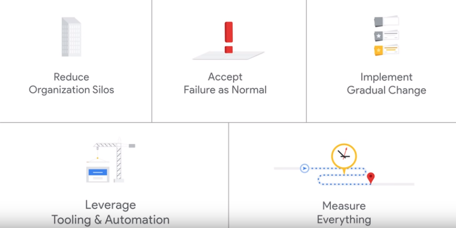
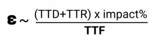
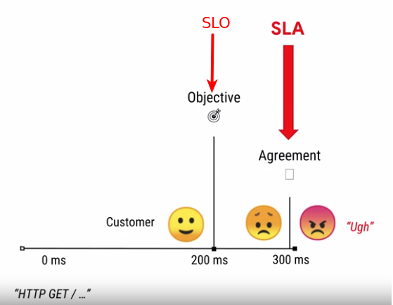
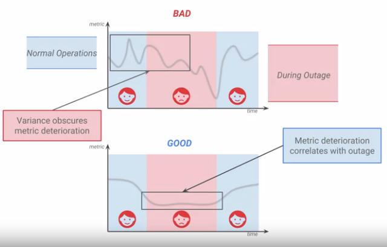
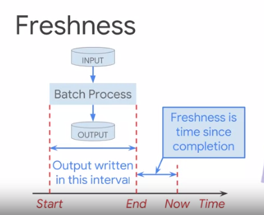

# SRE

## SRE Tasks

1. **Reduce Organization Silos** - reduce the barier between developers and operation guys.
    * share the ownership of production with developers
1. Accept Failure as Normal
    * blameless postmortem
    * make sure that failure won't happend the same way second time
    * use error budget
1. Implement Gradual Change
    * small releases instead of big one
    * canary releases
1. Leverage Tooling & Automation
    * automate manual work (eliminate toil)
1. Measure Everyting
    * amount of toil we have
    * the reliability of our systems

## Reliability
1. **Reliability** - when system is able to perform it's functions.
1. Reliability is the most important feature.
1. Users, not monitoring decide reliability.
1. Well engineered software could get you up to the three nines (not more!)
1. There are two types of work on improving reliability
    * reactvie - well trained incident response
    * proactive - removing bottlenecks, automating processes and isolating failure.
1. There is always tension between reliability and new features. The more features you release the less reliabile you become.
1. **Error budget** - the amount of time that you could be unreliable, but still maintain SLO.
    * once the error budget is less than 0, you should stop releasing new features and focus on reliability.
    * by having this concept we could decrease the tension between Devs and Ops.

## Improving Reliability
1. Minimal time to recovery consist of:
    * time to discover
    * time to resolution
1. It's also very important to consider the "impact" of the issue.

    

1. To improve reliability we could do:
    * increase time to failure
        * reduce the amount of technical debt
        * improve test coverage
        * standardize infrastructure
        * blameless portmortems
    * reduce time to discovery
        * alerting
        * monitoring
    * reduce time to recovery
        * self-healing
        * monitoring - to help gather the information
        * improve logging - for going deeper into details
        * improve automation - automating tasks like failover
        * playbooks
        * save release and rollback systems
    * reduce impact
        * improve canary analysis
        * engineering service to work in partial failure case

## SLA, SLO, SLI
1. **Service Level Agreement** (SLA) - promise to customers, if this promise is failed there are financial (or other) consequences.
1. **Service Level Objective** (SLO) - internal promise to meet customers objectives. Should be stronger than SLA, because usually customers are affected much earlier than the SLA breach

    

1. SLO need to be adjusted over the time.
1. **Service Level Indicator** (SLI) - the metric used to measure SLO.
1. How to choose good SLI:
    * it should be quantifiable
    * it should be close to user expirience (users do not care if your database is down or if the load balancer is overloaded, from their perspective the website is down or slow)
    * should be stable without a big variance

    

## SLI
### Request / response SLI
1. **Availability** - the proportion of valid requests served successfully
1. **Latency** - the proportion of valid requests served faster than a threshold. Should be set on the long tail. For example 99% of the requests should be served within 100ms. But it's always worth to consider other percentiles like (75%, 90%, 95%).
1. **Quality** - the proportion of valid requests served without degrading quality. For example in case of an outage you could serve stale requests from cache. In this case, you still fullfill latency and availability SLI, but you work with degraded quality.

### Data Processing SLI
1. **Freshness** - the proportion of valid data updated more recently than a threshold.
    * for batch processing
        

    * for stream processing
        
1. **Correctness** - the proportion of valid data producing correct output. The measurement of correctness should be independent from the code calculating data, otherwise in case when the result is incorrect we will still count it as correct one.
1. **Coverage** - the proportion of valid data processed successfully (similar to availability for request/response).
1. **Throughput** - the proportion of time where the data processing rate is faster than a threshold (similar to latency for request/response). Easy to explain in bytes per second, the system should expose this metric.

### Storage SLI
1. **Availability**
1. **Latency**
1. **Durability**
