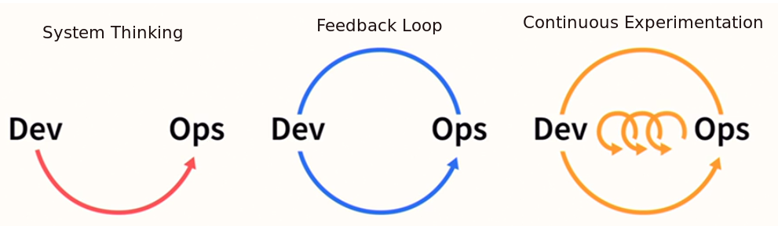
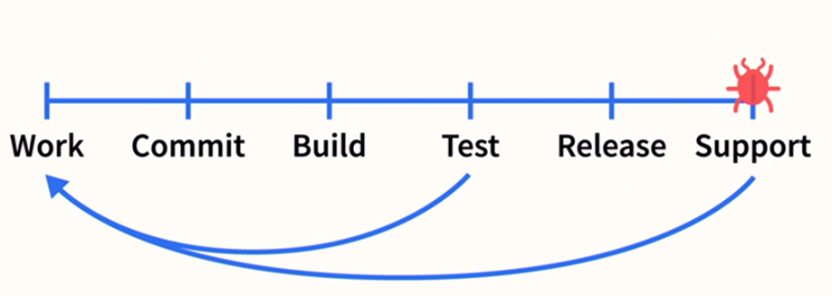
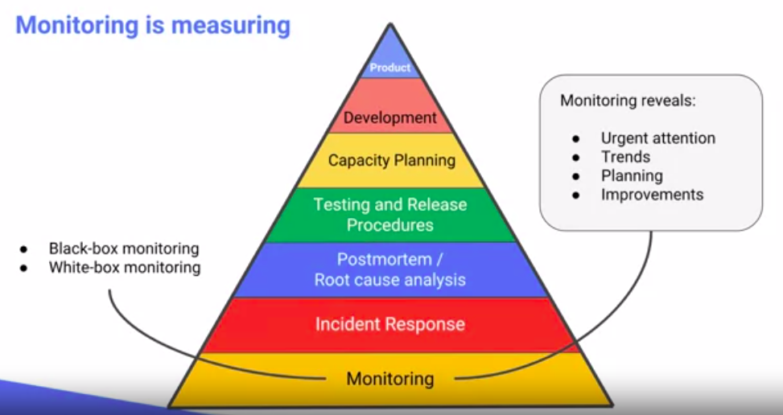

# DevOps

  * [Core Values](#core-values)
  * [Principles](#principles)
  * [SRE Pyramid](#sre-pyramid)
  * [SRE Tasks](#sre-tasks)
  * [Observability](#observability)

## Core Values
1. **C**ulture
    * remove the wall between dev and ops
1. **A**utomation - automate everything, but put people over processes over tools.
    * Define how is responsible for job function
    * Put people first (like who is going to take over a task, then what kind of processes are we going to optimize and why do we need it, and only then think about the tools to implement task).
1. **M**easurement - measure key metrics across the organization during devops transformation.
    * MTTR
    * Cycle Time
    * Cost
    * Revenue
    * Employee satisfaction
1. **S**haring - feedback loop that helps continuously improve.

## Principles

1. **System thinking** - always think how your changes impact the whole system.

1. **Feedback Loop** - think how to improve feedback loop. Efficient feedback loop speeds up development a lot. The earlier in feedback loop we found a bug - the less expensive is to fix it.

    

1. **Continuous Experimentation** - focus on the creation of experimentation culture.
    * Learning and applying new things and getting fast feedback on changes, instead of going into analysis paralysis.
    * Better way to learn something is to try it, if we have an efficient tool chain for experimentation - we enforce this culture.
    * Working code wins.

## SRE Pyramid

## SRE Tasks
1. **Reduce Organization Silos** - reduce the barier between developers and operation guys.
    * share the ownership of production with developers
1. **Accept Failure as Normal**
    * blameless postmortem
    * make sure that failure won't happend the same way second time
    * use error budget
1. **Implement Gradual Change**
    * small releases instead of big one
    * canary releases
1. **Leverage Tooling & Automation**
    * automate manual work (eliminate toil)
1. **Measure Everyting**
    * amount of toil we have
    * the reliability of our systems

## Observability
Everything that happens with our system is events (like http request, read packet from network, allocate more memory and so on). It will be great if we could collect all the events for observability, but it's not practical. That's why there are many ways to collect data and use it in a special ways:

1. **Profiling** - we have some of the context for limited amount of time (like `tcpdump`)
1. **Tracing**  - get some proportion of events that pass through some functions of interest and store this timing. Usually used to see the request path and how much time each step took.
1. **Logging** - store almost all the context for a limited set of events. There are the following types:
    * Transaction logs - critical business records that you must keep save at all cost
    * Request logs - HTTP requests or database calls.
    * Application logs - some system level events, like backups, maintanance and so on.
    * Debug logs - detailed logs for troubleshooting., maintanance and so on.
1. **Metrics** - a lot of aggregated events, mostly without context (just a few labels).
