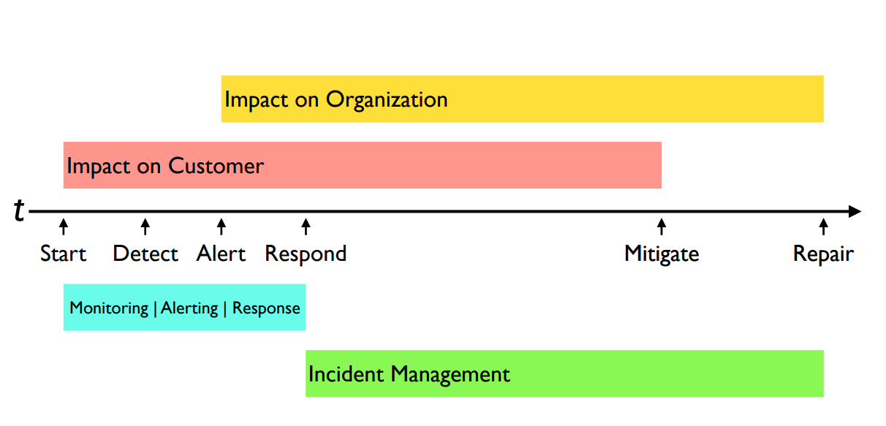
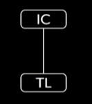
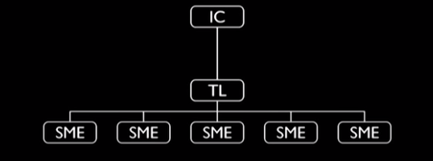
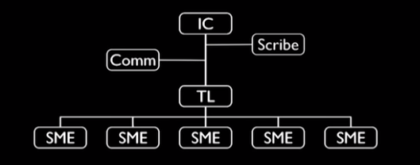
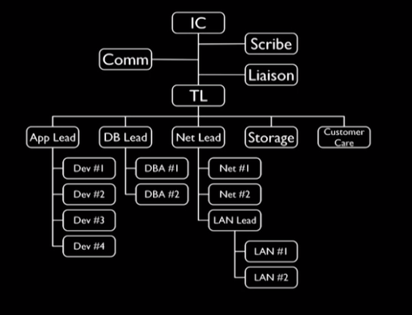

# Incident Management

## Timeline

## Best Practices
1. We should have two modes of operations with a clear distinction between them
    * **Normal Operations**
    * **Emergency Operations**
1. Practice, practice, practice, then practice some more.

## Incident Command System Principles
1. Common terminology
1. Explicity transfers of responsibility
1. Clear communications

## Incident org chart

Definitions:
* **IC** - Incident Commander
* **TL** - Tech Lead
* **SME** - Subject Matter Expert (firefighter)
* **Comm** - Communication Lead (communicate with users, stackholders and executives)
* **Scribe** - document what is going on

Important:
    * **Focus on roles, not indivisuals.**

People involve as incident grows:

1. Start of an incident

    

    * Usually IC is an on-call person
    * IC at start fullfil all the roles, including comminication and scribe
    * IC could **explicitly** transfer this role later

1. Escalate and involve more firefighters

    

1. Add more visibility to the users

    

1. Add more firefighters

    

