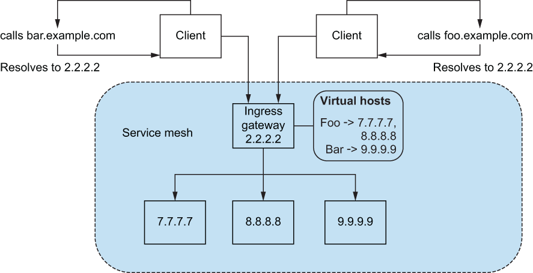

# Istio

## Ingress Gateway



### Explore Gateways

1. Get Gateways

```
kubectl get gw
```

1. Listener configs

```
istioctl -n istio-system proxy-config listener deploy/istio-ingressgateway
```

1. get virtual hosts

```
kubectl get vs
```

1. Route configs

```
istioctl proxy-config route deploy/istio-ingressgateway -o json --name http.8080  -n istio-system
```
