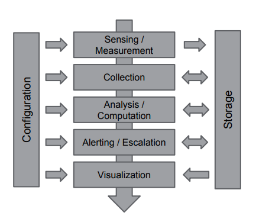

# Monitoring

  * [Philosophy](#philosophy)
    + [Goals](#goals)
    + [Anti-Patterns](#anti-patterns)
    + [Design Patterns](#design-patterns)
  * [Metrics](#metrics)
    + [The Four Golden Signals](#the-four-golden-signals)
    + [Additional usefull metrics](#additional-usefull-metrics)
    + [Metric Best Practicies](#metric-best-practicies)
  * [Alerts](#alerts)
    + [Alerts Questions](#alerts-questions)
    + [Alerts Philosophy](#alerts-philosophy)
    + [Alerts best practices](#alerts-best-practices)
  * [In Real Life](#in-real-life)

## Philosophy

### Goals
1. **Alerting**
1. **Debugging**
1. **Capacity Planning**
1. **Expiriments** - compare before and after
1. **Business Analisys**

### Anti-Patterns
1. Tool Obsession
1. Monitoring-as-a-Job
    * it's good to have observability team, which goal is to build monitoring infrastructure that developer teams will use
    * observability team should not setup metrics and alerts, because this team does not now the application insight
    * developer teams should use the monitoring tools provided by observability team to setup alerts and monitoring
1. Checkbox Monitoring - having a monitoring just to say that you have it
    * you record system load, CPU usage, memory utilization but when your service is down you don't know why.
    * you ignore alerts
    * you are checking system for metrics every five minutes or even less
    * you aren't storing historical metric data
    * **OS metrics are not usefull for alerting**
1. Using Monitoring as a Crutch
    * Monitoring should be the only one solution for poorly built app problem. In addition to monitoring it's good to improve app itself.
    * Monitoring doesn't fix broken things
1. Manual configuration

### Design Patterns
1. Composable monitoring - use multiple specialized tools and couple them loosely together.
1. Monitoring from the User Perspective
    * start monitoring closer to user
1. Buy, Not Build
1. Continual Improvement

### Common Scheme

## Metrics
### The Four Golden Signals
1. **Latency**
1. **Traffic**
1. **Errors**
1. **Saturation**

### Additional usefull metrics
1. **Intended Changes** - changes is the number one source of any issues. It's very usefull to have all the change logs in one place. Type of changes:
    * release of new software version
    * configuration update
    * infrastructure update
    * hardware update
1. **Dependencies** - you should always monitor your dependencies. So that, in case of emergency you could immideately understand that service dependency is the root cause of issue.
    * the health of dependency
    * availability, latency and errors of dependent service

### Metric Best Practicies
1. Every collected metric should have a [purpose](#goals)
1. Worry about your tail
1. Use the combination of **whitebox** and **blackbox** monitoring.
    * with white box monitoring you could analyze the internal metrics for you application
    * if the server is down or DNS is down you white box monitoring wan't see it.
1. As simple as possible, no simplier
    * the rules that catch real incidents most often should be as simple, preductable, and reliable as possible
    * data collection, aggregation, and alertig configuration that is rarely exercised should be up for removal
    * signals that are collected, but not exposed in any prebacked dashboard nor used by any alert, are candidates for removal

### Virtual Machine
1. CPU Usage
1. Memory
1. Disk Traffic
1. Network Usage
1. Clock Drift

### Database Metrices
1. Connections (threads in mysql)
1. QPS
1. Queries duration
1. Replication lag
1. IOPs
1. Disk Usage

### Message Queues
1. Queue Length
1. Publish Rate
1. Consumption rate

### Cache
1. Cache evicted ratio
1. Cache hit ratio (hit / (hit + miss)

### DNS
1. Zone transfers (when slave sync with master)
1. QPS
    * at least QPS for server
    * better QPS per zone
    * the best QPS per view

## Alerts
### Alerts Questions
1. Does this rule detect an otherwise undetected condition that is urgent, actionable, and actively or imminently user-visible?
1. Will I ever be able to ignore this alert, knowing it's beningn? When and why will I be able to ignore this alert, and how can I avoid this scenario?
1. Does this alert definitely indicate that users are being negatively affected? Are there detectable cases in which users aren't being negatively impacted, such as drained traffic or test deployments, that should be filtered out?
1. Can I take action in response to this alert? Is that action urgent, or could it wait until morning? Could the action be safely automated?
1. Does everyone from the notification list really need to be notified?

### Alerts Philosophy
1. Every time the pager goes off, I should be able to react with a sense of urgency. I can only react with a sense of urgency a few times a day before I become fatigued.
1. Every page should be actionable.
1. Every page response should require intelligence. If a page merely merits a robotic response, it shouldn't be a page.
1. Pages should be about a novel problem or an event that hasn't been seen before.

### Alerts best practices
1. Alerts should not flap
1. One event should trigger as less alerts as possible.
    * when there are a lot of triggered alerts in case of an incident - it creates a lot of noice and complicates troubleshooting.
1. It's great when every alert have attached runbook for on-call engineer.
1. **Test your monitoring system** - as you setup your monitoring system you could not be fired by an alert for months or years, so it's very important to be sure over time that your alerts are not broken.

## In Real Life
1. Global monitoring

    

1. There is a set of labels for every metric. Metrics could be filtered by one or many labels.
1. Label types:
    * type of metric, e.g. _http-response_
    * source of data, e.g. _instance-name_
    * locality or aggregation of the data, e.g. _zone_ or _datacenter_
