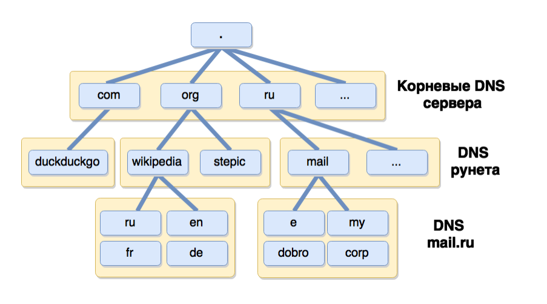
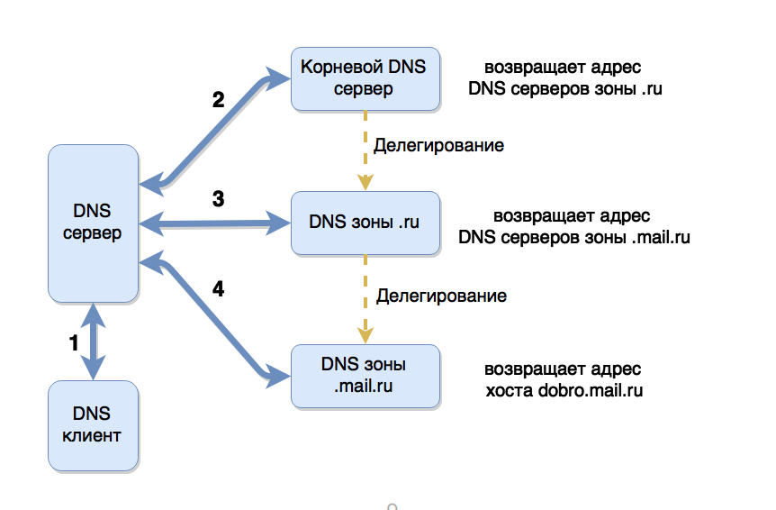

# DNS

## Table Of Content
- [Common](#common)
- [Определение IP адреса](#определение-ip-адреса)
- [DNS records](#dns-records)
- [DNS lookup utilites](#dns-lookup-utilites)
- [Configuration](#configuration)

## Common
1. **`DNS`** - это распределенная база данных, хранящая информацию о доменах, в первую очередь отображение доменных имён на `IP` адреса машин, обслуживающих эти домены.
1. `DNS` не связан с другими протоколами из `HTTP` стека, задача `DNS` просто ответить какой IP адрес соответствует доменному имени.
1. База DNS разделена на **зоны**. Каждая зона находится под единым административным контролем. Проще говоря обслуживается одной организацией.
1. Хранние информации о доменах более высокого уровня может быть **делегированно** другим зонам.
    
1. _Домен (доменное имя)_ - арендуется у регистратора. После аренды у регистратора нужно прописать `DNS сервер` которому делегируется определение IP адреса для данного домена. При этом данные `DNS сервера` должны быть указанны как _NS запись_ данного домена.
1. _Регистратор_ - компания у которой есть контроль над зоной первого уровня. (к примеру регистратор хранящий зону `.ru`)

## Определение IP адреса
1. Браузер (или другой клиент):
    * смотрит свой кэш на наличие IP адреса для запрашиваемого `DNS` имени
    * если находит IP адрес возвращает его
    * если не находит спрашивает у ОС
1. ОС:
    * смотрит свой кэш на наличие IP адреса для запрашиваемого `DNS` имени
    * если не находит то смотрит в файле `/ets/hosts`.
    * если не находит, то запускает `resolver` (программа прокси между ОС и DNS сервером).
1. Резолвер:
    * смотрит какой DNS сервер прописан в конфиге (обычно DNS сервер прописывает провайдер или админ сети)
    * отправляет запрос к DNS серверу
1. Что делает `DNS сервер` (в дополнение к описанному ниже проверятся кэш на каждом этапе)
    * part 0 (спрашиваем кто знает информацию о Top Level Domain). Обычно эта информация зашита в конфиге самого DNS сервера (таким образом чтобы добавить новый root сервер нужно поменять конфиги всех существующих DNS серверов)
        ```bash
        $ host -t NS .
        ...
        name server i.root-servers.net.
        ...
        ```
    * part 1 (спрашиваем кто знает информацию о зоне `ru.` у одного из root серверов)
        ```bash
        $ host -v -t NS ru. i.root-servers.net
        ...
        ;; AUTHORITY SECTION:
        ru.			172800	IN	NS	a.dns.ripn.net.
        ru.			172800	IN	NS	e.dns.ripn.net.
        ...
        ```
    * part 2 (спрашиваем у зоны DNS сервера зоны `ru.` у кого можно спросить про адрес мэйла)
        ```bash
        $ host -v -t NS mail.ru a.dns.ripn.net.
        ...
        ;; AUTHORITY SECTION:
        MAIL.RU.		345600	IN	NS	ns2.mail.RU.
        MAIL.RU.		345600	IN	NS	ns3.mail.ru.
        ...
        ```
    * part 3 (спрашиваем адрес яндекса)
        ```bash
        $ host -t A mail.ru ns2.mail.RU.
        ```
    * Весь процесс на картинке:
    
1. `TTL` - время кэширования DNS записи резолверами.
1. `DNS` может указывать куда угодно. К примеру можно создат `NS` запись которая будет указывать на `127.0.0.1`. Таким образом любой клиент запрашивающий Вашу днс запись будет переадресовываться сам на себя. Это можно использовать как один из способов борьбы с DDos-атакой

## DNS records
1. **Все DNS записи должны содержать точку в конце!**
1. **`A`** - IPv4 адрес(а) данного домена
    ```bash
    host -t A yandex.ru
    ```

    * Если **A** записей несколько то получаем `Roundrobin`.
    * Каждый из IP адресов в `Roundrobin` должен быть рабочий, иначе 1/n пользователей отвалится.
    * Система выбирает рандомную запись из `Roundrobin`.
    * Неправильно использовать `Roundrobin` для балансировки нагрузки.
1. **`AAAA`** - IPv6 адрес(а)
    * `Roundrobin` для нескольких `AAAA` записей работает с багом. Он всегда выбирает тот IP адрес который больше похож на IP адрес машины с которой идёт запрос. Поэтому не рекомендуется использовать `Roundrobin` с `IPv6` адресами.
1. **`MX`**  - адрес(а) почтовых серверов данного домена
1. **`CNAME`** - _alias_ для доменной записи. Т.е. когда один домен ссылается на другой.
    * Если у домена есть `CNAME` запись, то не может быть никакой друго записи любого типа
1. **`SOA`** - содержит техническую информацию о домене.
    ```bash
    $ host -t SOA yandex.ru

    yandex.ru has SOA record ns1.yandex.ru. sysadmin.yandex-team.ru. 2017081923 600 300 2592000 900
    ```
    * **primary name server** (ns1.yandex.ru)
    * **hostmaster** (sysadmin.yandex-team.ru) - почтовый ящик администратора данного домена (заменяем `.` на `@`)
    * **serial number** (2017081923)
    * **refresh** (600) - количество секунд, через которое `slave` реплики спрашивают у `master`а не произошло ли изменений в конфигурации
    * **retry** (300) - количество секунд, через которое `slave` делает `retry` с целью получения информации от `master'a
    * **expire** (2592000) - количество секунд, по истечении которых `slave` перестаёт делать `retry` с целью получения информации от мастера и отключается.
    * **minimum TTL** (900)
1. **`TXT`** - полезная информация о домене
1. **`PTR`** - обратная запись, используется для поиска домена по IP адресу. Используется:
    * `netstat` - показывает с `hostname` сервера с которого пришёл запрос
    * _почта_ - сравнивает `PTR` и `hostname` сервера отправляющего почту, если они совпдают то больше шансов, что почта не попадёт в спам.
    * **Firewall** - смотрят обратную запись, смотрят что прямая запись имеет тот же адрес, если всё корректно пропускает запрос. Таким образом можно прописывать в `firewall` не IP адреса а домены с которых идут запросы.
1. **`NS`** - указывает какие `DNS` сервера отвечают за домен
    * единственная **обязательная** запись

## DNS lookup utilites
1. **`host`**
    ```bash
    host -t A example.com ns-server.com
    ```
    * **`-v`** - verbose
    * **`-t`** - тип записи
    * **`example.com`** - что спрашиваем
    * **`ns-server.com`** - у кого спрашиваем

## Configuration
1. **`/ets/hosts`** - хранит дефолтный маппинг доменов и адресов. К примеру можно заблочить `vk.com`:
    ```
    127.0.0.1 localhost
    127.0.0.1 vk.com
    ```
1. **`/etc/resolf.conf`** - настройка резолвера и поискового домена
