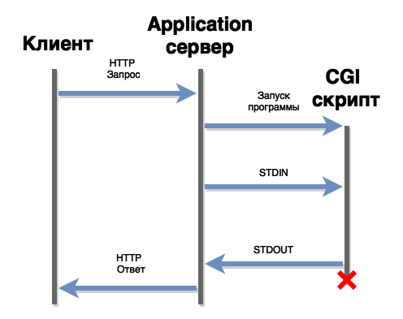

# Архитектура Frontend и Backend

## Table of content
- [Общая архитектура](#Общая-архитектура)
- [Reverse proxy](#reverse-proxy)
- [Application server](#application-server)

## Общая архитектура

## Задачи фронтэнд сервера
1. Отдача статических документов
1. Проксирование запросов к бекенд серверу (reverse proxy)
1. Балансировка нагрузки
1. Кэширование
1. Сборка SSI (сборка веб странички из небольших кусочков)
1. Авторизация, SSL, нарезка картинок, gzip

## Reverse proxy
* Основная задача - борьба с медленными клиентами. Т.е. к примеру у нас медленный клиент, который передаёт данные на сервер очень медленно и занимает при этом целый процесс. Если таких пользователей много, то в системе зависает много процессов, большинство из которых заняты передачей данных с\на клиент.
1. `frontend` (медленно) - читает запрос от клиента
1. `frontend` (быстро) передает запрос свободному `backend`.
1. `backend` генерирует страниу
1. `backend` (быстро) возвращает ответ `frontend` серверу.
1. `frontend` (медленно) - возвращает ответ клиенту

Результат: backend занят минимально возможное время.

## Application server
1. Роль application сервера заключается в исполнении бизнес-логики приложения и генерации динамических ответов.
1. На каждый HTTP запрос application сервер запускает некоторый обработчик в приложении. Это может быть функция, класс или программа, в зависимости от технологии.
1. Протоколы запуска веб приложений:
    * Servlets - обработчики в виде классов, веб сервер запускает методы этих классов (используется в Java)
    * mod_perl, mod_python, mod_php - утилиты для Apache
    * CGI - запускаемое приложение
    * FastCGI, SCGI - модификации CGI решающие некоторые его проблемы
    * PSGI (for perl), WSGI (for python), Rack (for ruby)

## CGI
1. **`CGI`** - Common Gateway Interface

    

1. Создавался для создания динамических сайтов. Т.е. frontend сервер запускает какое-либо приложение, передаёт ему параметры и отправляет результат работы приложения в виде ответа.
* Метод, QueryString, заголовки запроса - через переменные окружения
* Тело запроса передается через **STDIN**
* Заголовки и тело ответа возвращаются через **STDOUT**
* HTTP код ответа передается через псевдозаголовок **Status**
* Поток ошибок **STDERR** направляется в лог ошибок сервера.
