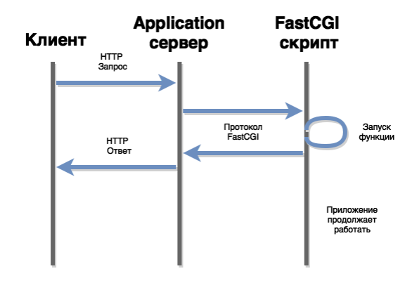
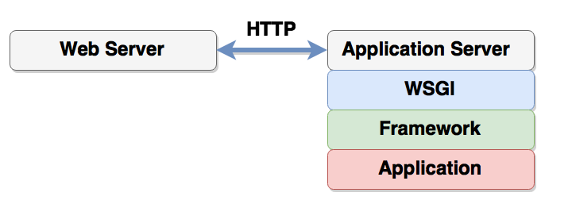

# Архитектура Frontend и Backend

## Table of content
- [Общая архитектура](#Общая-архитектура)
- [Reverse proxy](#reverse-proxy)
- [Application server](#application-server)
- [CGI](#cgi)
- [WSGI](#wsgi)

## Общая архитектура


## Задачи фронтэнд сервера
1. Отдача статических документов
1. Проксирование запросов к бекенд серверу (reverse proxy)
1. Балансировка нагрузки
1. Кэширование
1. Сборка SSI (сборка веб странички из небольших кусочков)
1. Авторизация, SSL, нарезка картинок, gzip

## Reverse proxy
* Основная задача - борьба с медленными клиентами. Т.е. к примеру у нас медленный клиент, который передаёт данные на сервер очень медленно и занимает при этом целый процесс. Если таких пользователей много, то в системе зависает много процессов, большинство из которых заняты передачей данных с\на клиент.
1. `frontend` (медленно) - читает запрос от клиента
1. `frontend` (быстро) передает запрос свободному `backend`.
1. `backend` генерирует страниу
1. `backend` (быстро) возвращает ответ `frontend` серверу.
1. `frontend` (медленно) - возвращает ответ клиенту

Результат: backend занят минимально возможное время.

## Application server
1. Роль application сервера заключается в исполнении бизнес-логики приложения и генерации динамических ответов.
1. На каждый HTTP запрос application сервер запускает некоторый обработчик в приложении. Это может быть функция, класс или программа, в зависимости от технологии.
1. Протоколы запуска веб приложений:
    * Servlets - обработчики в виде классов, веб сервер запускает методы этих классов (используется в Java)
    * mod_perl, mod_python, mod_php - утилиты для Apache
    * CGI - запускаемое приложение
    * FastCGI, SCGI - модификации CGI решающие некоторые его проблемы
    * PSGI (for perl), WSGI (for python), Rack (for ruby)

## CGI
1. **`CGI`** - Common Gateway Interface. Создавался для создания динамических сайтов. Т.е. frontend сервер запускает какое-либо приложение, передаёт ему параметры и отправляет результат работы приложения

    

    * Метод, QueryString, заголовки запроса - через переменные окружения
    * Тело запроса передается через **STDIN**
    * Заголовки и тело ответа возвращаются через **STDOUT**
    * HTTP код ответа передается через псевдозаголовок **Status**
    * Поток ошибок **STDERR** направляется в лог ошибок сервера.
1. Минусы:
    * каждый раз программу нужно прочитать с диска
    * в зависимости от языка команду может потребоваться интерпретировать (Python, Javascript)
    * устанавливается соединение к БД
1. Переменные окружения CGI
    * `RESUEST_METHOD`
    * `PATH_INFO` - путь из URL (`/document/10`). На основе этого параметра application сервере выбирает какой обработчик вызывать.
    * `QUERY_STRING` - фрагмент URL после `?` (параметры обработчика).
    * `REMOTE_ADDR` - IP адрес пользователя
    * `CONTENT_LENGTH` - длина тела запроса (чтобы скрипт знал сколько данных нужно читать из stdin)
    * `HTTP_COOKIE` - заголовок `Cookie`
    * `HTTP_ANY_HEADER_NAME` - заголовок HTTP
1. `FastCGI` и `SCGI` - решают проблему `CGI` с производительностью путем демонизации приложения. Иногда это возможно сделать даже без изменения кода `CGI` приложения.
    * Взаимодействие между application сервером и скриптом происходит через сокет.

    

## WSGI
1. **`WSGI`**, PSGI, Rack - протоколы вызова функции обработчика из application сервера. Сам application server при этом может выполняться в отдельном процессе или совпадать с web сервером. Как правило, при использовании этих протоколов в качестве application сервера выступает отдельный легковесный процесс.
    ```python
    # environ conatins CGI-like variables
    def wsgi_application(environ, start_response):
        status = '200 OK'
        headers = [
            ('Content-Type', 'text/plain')
        ]
        body = 'Hello, world!'
        start_response(status, headers)
        return [body]
    ```
1. **`WSGI`** (Web Server Gateway Interface)
    * Обработчик - функция или класс (что-то можно можно вызывать)
    * Метод, QueryString, заголовки запроса - через аргумент **environ**
    * Тело запроса передается через file-handle wsgi.input
    * HTTP код ответа и заголовки ответа передаются через вызов функции **start_response**
    * Тело ответа возвращается в виде списка (iterable) из обработчика
    * Поток ошибок должен быть направлен в file-handle **wsgi.stderr**
1. Взаимодействие Web Server'a и WSGI приложения

    
