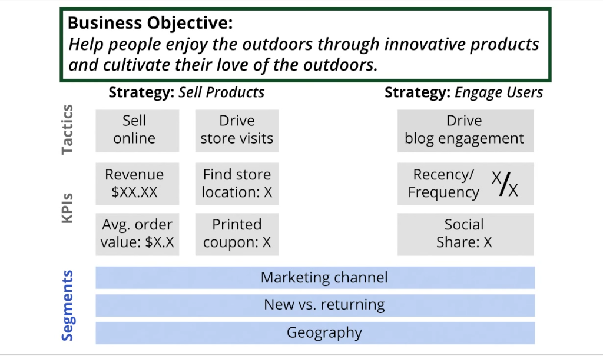

# Google Analytics

## Common

1. **Digital analytics** is the analysis of **qualitative and quantitative data from your business** and the competition to drive a **continual improvement** of the online experience that your **customers** and potential customers have which translates to your desired **outcomes**.

2. Outcomes
    * **Ecommerce** - drive product sales
    * **Content publisher** - encourage frequent visitation
    * **Online information/support** - provide information quickly
    * **Branding** - encourage engagement and awareness
    * **Lead generation** - drive contact form submissions

3. **Conversion** - a completed activity that you deem important to you buiseness goal
    * **Macro conversion** - in ecommerse it is saling a product
    * **Micro conversion** - in ecommerce it is viewing a product video or rating a product
    * [Macro and micro conversions](https://support.google.com/analytics/answer/2665457)

4. **Attribution** - assigning credit for a conversion.
    * Ex: from which chanell we recived that conversion

5. **Attribution model** - rules that define how to assign credit a conversion.
    * **last click attribution** - all conversion credit assign to the last action that provided that conversion
    * **first click attribution** - all conversion credit assign to the first action that provided that conversion
    * **linear attribution**
    * [Attribution modeling examples](https://support.google.com/analytics/answer/1665189)

## Measurement planning

1. Steps to introduce analytics
    1. Define measurement plan
    2. Document technical infrastructure
    3. Create implementation plan
    4. Implement tracking recomendations
    5. Maintain and refine measurement plan
2. Measurement planning
    1. Document business objectives
    2. Identify strategies and tactics
    3. Choose Key Performance Indicators (KPI)
    4. Choose segments
    5. Choose plan target
3. Measument plan example for Outdoor Equimpment company:
    
4. [Digital Marketing and measument model](http://www.kaushik.net/avinash/digital-marketing-and-measurement-model/)

## Google Analytics components
1. Data Collection
2. Configuration
3. Data Processing
4. Reporting

## Definitions

1. **Dimension** - describes characteristic of you users, their sessions and actions
    * User Dimension - Geography
    * Session Dimension - traffic source
    * Interaction dimension - name of the page, url
8. **Metric** - is a number which is used to measure one of the characteristics of a dimension
    * The metric of the city dimension is how many users we have from it
5. **Event**  - an action that is tarcked when a user interacts with content
    * Plaing a video or downloading a PDF
6. **Goal** - used to track discrete actions and their value
    * When a goal is succed the conversion is send to google analytics
7. **Hit** - an interaction that sends data to Google Analytics
    * Viewing a page
    * Clicking a button
9. **Pageview** - when a page is loaded or relloaded in the browser
10 **Segment** - a part of data. Set of users that share common attributes
11. **Source** - the origin of traffic
12. **Medium** - the category of the source

## Filters
1. We can create filter to modify/filter traffic. For example we can exclude some IP from analytics

## References

1. [ Understanding your customers and the full value of digital](https://analytics.googleblog.com/2013/01/insights-for-2013-understanding-your.html)

Stayed at 3.1