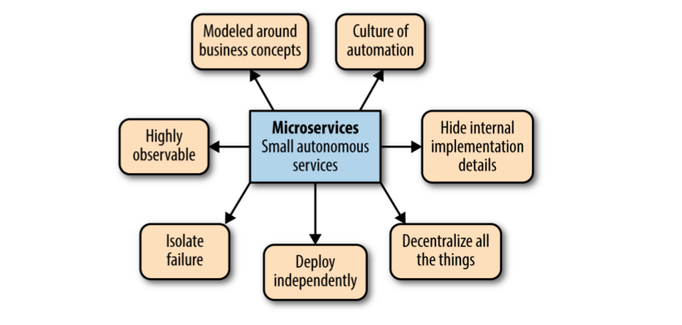

# Microservices

## Principles

## Common
1. The goal is create fully isolated service. Which could and should be deployed independenly.
1. Do not start with microservices. Because getting bounded context wrong it's very expensive. So it's better to wait until thigs become stable
1. **Retry all requests**
1. Topic for unhandled messages

## API
1. Use correct HTTP status codes
1. Use correct verbs for HTTP requests
1. Use one of the well-known style guide ([paypal](https://github.com/paypal/api-standards/blob/master/api-style-guide.md))
1. Use _Hypermedia AS the Engine of Application State_ to reduce coupling. It means send hyperlinks of next actions to a client.Pass reference to the resource in message, not the resource itself. Because by the time message is handled resource my have changed.
1. Send with API only necessary fields, by doing this we can change our inner models more easyly
1. Use HTTP 202 response code, indicating that the request was accepted but has not yet been processed
1. Handle versioning of end points. Doing this we can release a new version of service **A** `v2`, but we should support `v1`. Then if we have service **B** which use some of the API of service **A**, we don’t have to release new version of **B**, because **B** still can use version `v1`.

## Bounded Context
1. We should split bounded context according to a buissness goals, not according to a data models.
1. Share only necessay fields of shared models

## Migration from monolith
1. Identify bounded contexts
1. Move bounded contexts into separate modules
1. Remove unnecessary cross-modules interactions (e.g. if warehouse for some reasone use finance department module)
1. Put database associated code into separate modules
1. Split database schemas and reduce joins between different bounded contexts
1. Choose the most appropriate part (easy to split, need a lot of changes in the feature, necessety to change framework e.t.c) of separation and split it from the monolith
1. Start with a place where mistakes cost less

## Deployment
1. Use only necessary configuration for every service
1. Test docker images not standalone code
1. Use dedicated system for providing configuration
1. Use blue\green deployment
1. Pass configuration only throw `ENV` variables

## Tests
1. Split all your tests the following categories:
    * Unit Tests - test a couple of lines of code
    * Service Tests - tests a service downstream dependencies. Implemented by stubbing other services dependencies.
    * Consumer Driven tests - service tests expectations of every of its consumer
    * Integration tests - check that our stubs (mochs) are correct
    * End-to-End Tests - tests a service in real environment
1. Check [Mountebank](http://www.mbtest.org/) - it allows to stub http services
1. Fix or remote non-deterministic tests. [Eradicating Non-Determinism in Tests](https://martinfowler.com/articles/nonDeterminism.html)
1. Decrease as possible the running time of tests.
1. Use mocks to check remove services dependencies. Minimize the real call to remote services.
1. Create integration tests which should assert services mochs expetations
1. We should have few amount of end-to-end tests, which covers base "user journeys". The best case when we don't need end-to-end tests at all.

## Monitoring
1. Health check for whole system
1. Health check for every server
1. Log aggregation
1. Monitor downstream communications
1. Use correlation ID in logs (to visualize sequential processes)

## Articles
1. [12 factored apps](https://12factor.net/)
1. [12 factored apps addition](https://medium.com/@kelseyhightower/12-fractured-apps-1080c73d481c)
1. [IntegrationContractTest](https://martinfowler.com/bliki/IntegrationContractTest.html)
1. [SelfInitializingFake](https://martinfowler.com/bliki/SelfInitializingFake.html)
1. [Eradicating Non-Determinism in Tests](https://martinfowler.com/articles/nonDeterminism.html)

##Books
1. [REST in Practice](http://shop.oreilly.com/product/9780596805838.do)
1. [Catastrophic Failover](https://martinfowler.com/bliki/CatastrophicFailover.html)
1. Enterprise Integration Patterns
1. Refactoring Databases
1. Growing Object-Oriented Software, Guided by Tests
1. [Continious Delivery](https://www.amazon.com/Continuous-Delivery-Deployment-Automation-Addison-Wesley/dp/0321601912)
1. [Kubernetes: Up and Running](http://shop.oreilly.com/product/0636920043874.do)