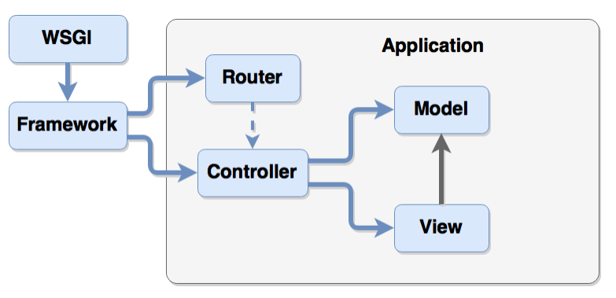

# MVC

## Роли компонентов MVC

* **Router** - выбор конкретного controller по URL
* **Model** - реализация бизнес-логики приложения
* **Controller** - работа с HTTP, связь controller и view
* **View** - генерация HTML или другого представления
