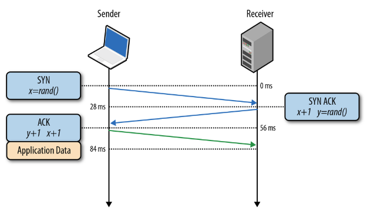

# TCP

## Зачем нужен TCP
1. **`TCP`** - протокол, обеспечивающий надежную последовательную доставку данных. Фактически, TCP предоставляет интерфейс, похожий на файловый ввод\вывод для сетевых соединений.
1. TCP обеспечивает
    * Надежную доставку (если отправитель получил сообщение что пакет доставлен, то он действительно доставлен)
    * Двухсторонняя передача данных (клиент => сервер, сервер => клиент)
    * Контроль потока - защита от переполнения. Т.е. чтобы отправитель не отсылал пакеты быстрее, чем получатель способен получить (в противном случае получаем переполнение буфера)

## TCP порты
1. **`TCP порт`** - это "адрес" сетевого соединения в пределах одного хоста. TCP порты позволяют поддерживать множество открытых соединений на одной машине.
1. Номер порта - целое число, не больше 65535. Порты ниже 1024 требуют привелегий суперпользователя для использования.
1. Стандартные TCP порты
    * 20, 21 - FTP
    * 22 - SSH
    * 25 - SMTP (почта)
    * 80 - HTTP
    * 443 - HTTPS

## Установление TCP соединения

