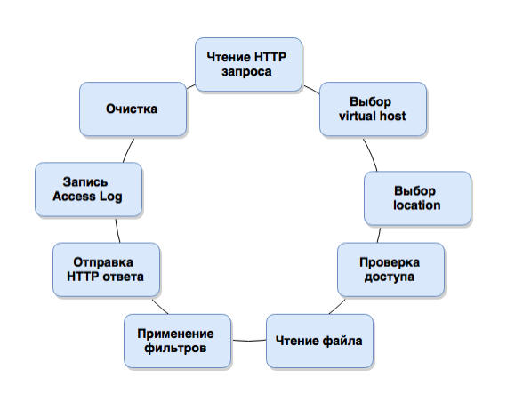
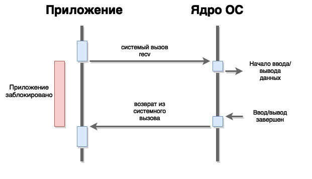
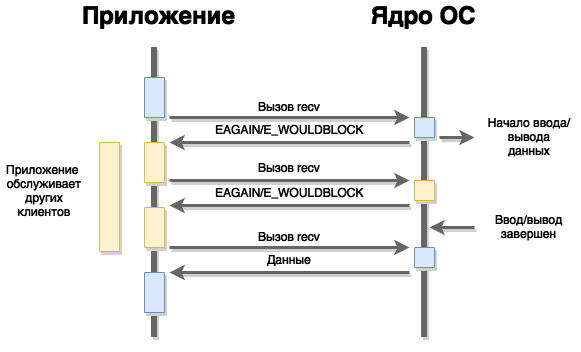

# Web Servers

## Table of content
- [Виды вебсерверов](#виды-вебсерверов)
- [Процессы web сервера](#процессы-web-сервера)
- [Модульная архитектура](#модульная-архитектура)
- [Модели обработки сетевых соединений](#модели-обработки-сетевых-соединений)

## Виды вебсерверов
1. Apache - prefork (предпочитаемый режим работы), worker, threads, C
1. Tomcat, Jetty - threads, Java
1. Starman, Gunicorn - prefork, языки высокого уровня (Starman - Perl, Gunicorn - Python)
1. Nginx, Lighttpd - асинхронные, С
1. Node.JS, Tornado - асинхронные высокго уровня (Node.JS - JavaScript, Tornado - Python)
1. IIS7

## Процессы web сервера
1. Master (user: root, 1 процесс)
    * чтение и валидация конфига
    * открытие сокета (ов) и логов
    * запуск и управление дочерними процессами (worker)
    * Graceful restart, binary updates
1. Worker (user: www-data or no-body, 1+ процессов)
    * обработка сетевых запросов

## Цикл обработки запроса


1. Чтение HTTP запроса из соединения (соединение предоставляет master процесс)
1. Выбор virtual host (на основе заголовка `Host`)
1. Выбор location и определение пути к файлу который нужно отдать.
1. Проверка доступа к отдаваемому файлу
1. Чтение файла с диска
1. Применяем выходные фильтры (сжатие gzip, разбитие на части в случае большого документа)
1. Отправка HTTP ответа
1. Запись Access Log
1. Очистка выделенной для обработки запроса памяти.

## Модульная архитектура
1. У большинства популярных веб-серверов существует модульная архитектура. Т.е. есть ядро и опционально подключаемые модули.
1. Задачи ядра:
    * открытие\закрытие соединений
    * обработка http запросов по циклу описанному выше
1. Модули можно подключать динамически. Модуль добавляет некоторые опции в конфиг веб сервера и добавляет некоторые middleware на каком-либо этапе обработки запроса.

## Модели обработки сетевых соединений.
1. Простейший TCP сервер для отдачи файлов в блокирующем режиме
    ```python
    import socket
    s = socket.socket(socket.AF_INET, socket.SOCK_STREAM)
    s.bind(('127.0.0.1', 8080))
    s.listen(10)
    while True:
        conn, addr = s.accept()
        path = conn.recv(512).decode('utf8').rstrip("\r\n")
        file = open('/www' + str(path), 'r')
        data = file.read().encode('utf8')
        conn.sendall(data)
        file.close()
        conn.close()
    ```

    * проблема вышеописанного сервера в том, что он не способен обрабатывать больше одного соединения одновременно.

    * Проблема особенна актуальна в случае медленной обработки запроса (медленный клиент, или медленная бизнес логика)

1. Блокирующий ввод-вывод

    

1. Решение проблемы блокирующего ввода-вывода:
    * множество потоков - multithreading<br>
        :heavy_plus_sign: зкономия памяти: 1 клиент = 1 поток<br>
        :heavy_minus_sign: требует аккуратной работы с памятью<br>
        :heavy_minus_sign: как следствие, накладывает ограничение на выбор библиотек<br>
    * множество процессов - prefork, pool of workers<br>
        :heavy_plus_sign: простота разработки<br>
        :heavy_plus_sign: можно использовать любые библиотеки<br>
        :heavy_minus_sign: большое потребление памяти: 1 клиент = 1 процесс<br>
        :heavy_minus_sign: проблема с долгоживущими соединениями<br>
    * комбинированный подход<br>

1. Неблокирующий ввод-вывод

    

    * после того как приложение отправило сообщение на ввод\вывод ядро возвращает сигнал `EAGAIN/E_WOULDBLOCK`. Это значит что операция в процессе выполнения и нужно позже спросить у ядра (так же методом `recv`), выполнилась ли она.

    * такой подход называется **мультиплексированием**

        ```python
        readsocks, writesocks = [...], [...] # сокеты
        while True:
            # readables - список сокетов, готовых для чтения (там уже есть данные и не нужно ждать их от клиента)
            # writables - список сокетов, готовых для записи (есть буфер достаточного размера)
            readables, writeables, exceptions = select(readsocks, writesocks, [])
        for sockobj in readables:
            data = sockobj.recv(512)
            if not data:
                sockobj.close()
                readsocks.remove(sockobj)
            else:
                print('\tgot', data, 'on', id(sockobj))
        ```
1. Event-driven разработка
    * множество открытых файловых дескрипторов
    * выбор сокетов готовых к работе
    * последовательная обработка событий <br>
    :heavy_plus_sign:быстро, программа не блокируется<br>
    :heavy_plus_sign:экономия памяти: 1 клиент = 1 объект<br>
    :heavy_plus_sign:обработка большого количества клиентов<br>
    :heavy_plus_sign:Обработка медленных или долгоживущих соединений<br>
    :heavy_minus_sign:тяжело программировать<br>
    :heavy_minus_sign:использование блокирующих вызовов всё портит<br>
